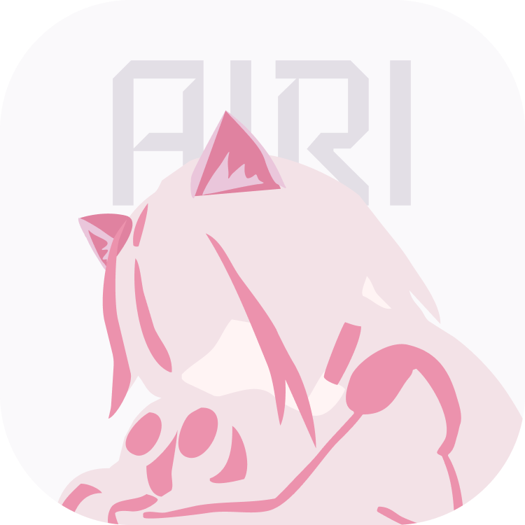
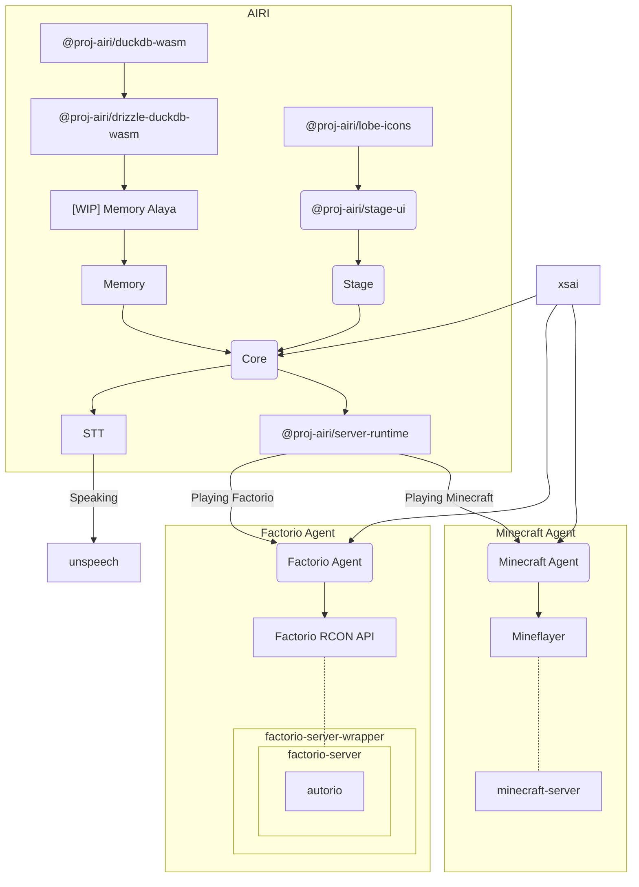
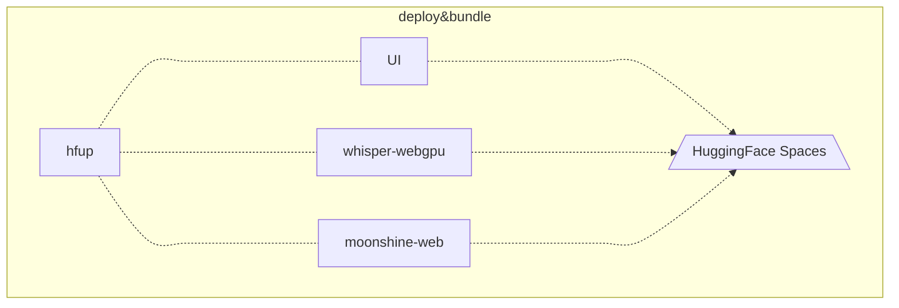

<p align="center">
  <picture>
    <source
      width="250"
      srcset="./docs/public/logo-dark.png"
      media="(prefers-color-scheme: dark)"
    />
    <source
      width="250"
      srcset="./docs/public/logo-light.png"
      media="(prefers-color-scheme: light), (prefers-color-scheme: no-preference)"
    />
    
  </picture>
</p>

<h1 align="center">Project AIRI</h1>

<p align="center">
  [<a href="https://discord.gg/TgQ3Cu2F7A">Join Discord Server</a>] [<a href="https:///airi.moeru.ai">Try it</a>] [<a href="https://github.com/moeru-ai/airi/blob/main/README.zh-CN.md">简体中文</a>] [<a href="https://github.com/moeru-ai/airi/blob/main/README.ja-JP.md">日本語</a>]
</p>

> Heavily inspired by [Neuro-sama](https://www.youtube.com/@Neurosama)


Unlike the other AI driven VTuber open source projects, アイリ VTuber was built with many support of Web technologies such as [WebGPU](https://www.w3.org/TR/webgpu/), [WebAudio](https://developer.mozilla.org/en-US/docs/Web/API/Web_Audio_API), [Web Workers](https://developer.mozilla.org/en-US/docs/Web/API/Web_Workers_API/Using_web_workers), [WebAssembly](https://webassembly.org/), [WebSocket](https://developer.mozilla.org/en-US/docs/Web/API/WebSocket), etc. from the first day.

This means that **アイリ VTuber is capable to run on modern browsers and devices**, and even on mobile devices (already done with PWA support), this brought a lot of possibilities for us (the developers) to build and extend the power of アイリ VTuber to the next level, while still left the flexibilities for users to enable features that requires TCP connections or other non-Web technologies such as connect to voice channel to Discord, or playing Minecraft, Factorio with you and your friends.

> [!NOTE]
>
> We are still in the early stage of development where we are seeking out talented developers to join us and help us to make アイリ VTuber a reality.
>
> It's ok if you are not familiar with Vue.js, TypeScript, and devtools that required for this project, you can join us as an artist, designer, or even help us to launch our first live stream.
>
> Even you are a big fan of React or Svelte, even Solid, we welcome you, you can open a sub-directory to add features that you want to see in アイリ VTuber, or would like to experiment with.
>
> Fields (and related projects) that we are looking for:
>
> - Live2D modeller
> - VRM modeller
> - VRChat avatar designer
> - Computer Vision
> - Reinforcement Learning
> - Speech Recognition
> - Speech Synthesis
> - ONNX Runtime
> - Transformers.js
> - vLLM
> - WebGPU
> - Three.js
> - WebXR ([checkout the another project](https://github.com/moeru-ai/n3p6) we have under @moeru-ai organization)
>
> **If you are interested in, why not introduce yourself here? [Would like to join part of us to build AIRI?](https://github.com/moeru-ai/airi/discussions/33)**

## Current progress

Capable of

- [x] Brain
  - [x] Play [Minecraft](https://www.minecraft.net)
  - [x] Play [Factorio](https://www.factorio.com) (WIP, but [PoC and demo available](https://github.com/moeru-ai/airi-factorio))
  - [x] Chat in [Telegram](https://telegram.org)
  - [x] Chat in [Discord](https://discord.com)
  - [ ] Memory
    - [x] Pure in-browser database support (DuckDB WASM | `pglite`)
    - [ ] Memory Alaya (WIP)
  - [ ] Pure in-browser local (WebGPU) inference
- [x] Ears
  - [x] Audio input from browser
  - [x] Audio input from [Discord](https://discord.com)
  - [x] Client side speech recognition
  - [x] Client side talking detection
- [x] Mouth
  - [x] [ElevenLabs](https://elevenlabs.io/) voice synthesis
- [x] Body
  - [x] VRM support
    - [x] Control VRM model
  - [x] VRM model animations
    - [x] Auto blink
    - [x] Auto look at
    - [x] Idle eye movement
  - [x] Live2D support
    - [x] Control Live2D model
  - [x] Live2D model animations
    - [x] Auto blink
    - [x] Auto look at
    - [x] Idle eye movement

## Development

> For detailed instructions to develop this project, follow the [CONTRIBUTING.md](./CONTRIBUTING.md)

```shell
pnpm i
```

### Documentation site

```shell
pnpm -F @proj-airi/docs dev
```

### Stage web (Frontend for [airi.moeru.ai](https://airi.moeru.ai), or [airi.ayaka.io](https://airi.ayaka.io))

```shell
pnpm -F @proj-airi/stage-web dev
```

### Stage Tamagotchi (Electron app for アイリ VTuber)

```shell
pnpm -F @proj-airi/stage-tamagotchi dev
```

### Publish

Please update the version in `Cargo.toml` after running the `bumpp`:

```shell
npx bumpp --no-commit --no-tag
```

## Supported the following LLM API Providers (powered by [xsai](https://github.com/moeru-ai/xsai))

- [x] [OpenRouter](https://openrouter.ai/)
- [x] [vLLM](https://github.com/vllm-project/vllm)
- [x] [SGLang](https://github.com/sgl-project/sglang)
- [x] [Ollama](https://github.com/ollama/ollama)
- [x] [Google Gemini](https://developers.generativeai.google)
- [x] [OpenAI](https://platform.openai.com/docs/guides/gpt/chat-completions-api)
  - [ ] [Azure OpenAI API](https://learn.microsoft.com/en-us/azure/ai-services/openai/reference) (PR welcome)
- [x] [Anthropic Claude](https://anthropic.com)
  - [ ] [AWS Claude](https://learn.microsoft.com/en-us/azure/ai-services/openai/reference) (PR welcome)
- [x] [DeepSeek](https://www.deepseek.com/)
- [x] [Qwen](https://help.aliyun.com/document_detail/2400395.html)
- [x] [xAI](https://x.ai/)
- [x] [Groq](https://wow.groq.com/)
- [x] [Mistral](https://mistral.ai/)
- [x] [Cloudflare Workers AI](https://developers.cloudflare.com/workers-ai/)
- [x] [Together.ai](https://www.together.ai/)
- [x] [Fireworks.ai](https://www.together.ai/)
- [x] [Novita](https://www.novita.ai/)
- [x] [Zhipu](https://bigmodel.cn)
- [x] [SiliconFlow](https://cloud.siliconflow.cn/i/rKXmRobW)
- [x] [Stepfun](https://platform.stepfun.com/)
- [x] [Baichuan](https://platform.baichuan-ai.com)
- [x] [Minimax](https://api.minimax.chat/)
- [x] [Moonshot AI](https://platform.moonshot.cn/)
- [x] [Tencent Cloud](https://cloud.tencent.com/document/product/1729)
- [ ] [Sparks](https://www.xfyun.cn/doc/spark/Web.html) (PR welcome)
- [ ] [Volcano Engine](https://www.volcengine.com/experience/ark?utm_term=202502dsinvite&ac=DSASUQY5&rc=2QXCA1VI) (PR welcome)

## Sub-projects born from this project

- [Awesome AI VTuber](https://github.com/proj-airi/awesome-ai-vtuber): A curated list of AI VTubers and related projects
- [`unspeech`](https://github.com/moeru-ai/unspeech): Universal endpoint proxy server for `/audio/transcriptions` and `/audio/speech`, like LiteLLM but for any ASR and TTS
- [`hfup`](https://github.com/moeru-ai/hfup): tools to help on deploying, bundling to HuggingFace Spaces
- [`xsai-transformers`](https://github.com/moeru-ai/xsai-transformers): Experimental [🤗 Transformers.js](https://github.com/huggingface/transformers.js) provider for [xsAI](https://github.com/moeru-ai/xsai).
- [WebAI: Realtime Voice Chat](https://github.com/proj-airi/webai-realtime-voice-chat): Full example of implementing ChatGPT's realtime voice from scratch with VAD + STT + LLM + TTS.
- [`@proj-airi/drizzle-duckdb-wasm`](https://github.com/moeru-ai/airi/tree/main/packages/drizzle-duckdb-wasm/README.md): Drizzle ORM driver for DuckDB WASM
- [`@proj-airi/duckdb-wasm`](https://github.com/moeru-ai/airi/tree/main/packages/duckdb-wasm/README.md): Easy to use wrapper for `@duckdb/duckdb-wasm`
- [`tauri-plugin-mcp`](https://github.com/moeru-ai/airi/blob/main/crates/tauri-plugin-mcp/README.md): A Tauri plugin for interacting with MCP servers.
- [AIRI Factorio](https://github.com/moeru-ai/airi-factorio): Allow AIRI to play Factorio
- [Factorio RCON API](https://github.com/nekomeowww/factorio-rcon-api): RESTful API wrapper for Factorio headless server console
- [`autorio`](https://github.com/moeru-ai/airi-factorio/tree/main/packages/autorio): Factorio automation library
- [`tstl-plugin-reload-factorio-mod`](https://github.com/moeru-ai/airi-factorio/tree/main/packages/tstl-plugin-reload-factorio-mod): Reload Factorio mod when developing
- [Velin](https://github.com/luoling8192/velin): Use Vue SFC and Markdown to write easy to manage stateful prompts for LLM
- [`demodel`](https://github.com/moeru-ai/demodel): Easily boost the speed of pulling your models and datasets from various of inference runtimes.
- [`inventory`](https://github.com/moeru-ai/inventory): Centralized model catalog and default provider configurations backend service
- [MCP Launcher](https://github.com/moeru-ai/mcp-launcher): Easy to use MCP builder & launcher for all possible MCP servers, just like Ollama for models!
- [🥺 SAD](https://github.com/moeru-ai/sad): Documentation and notes for self-host and browser running LLMs.





## Models used

- [onnx-community/whisper-large-v3-turbo · Hugging Face](https://huggingface.co/onnx-community/whisper-large-v3-turbo)

## Similar Projects

### Open sourced ones

- [kimjammer/Neuro: A recreation of Neuro-Sama originally created in 7 days.](https://github.com/kimjammer/Neuro): very well completed implementation.
- [SugarcaneDefender/z-waif](https://github.com/SugarcaneDefender/z-waif): Great at gaming, autonomous, and prompt engineering
- [semperai/amica](https://github.com/semperai/amica/): Great at VRM, WebXR
- [elizaOS/eliza](https://github.com/elizaOS/eliza): Great examples and software engineering on how to integrate agent into various of systems and APIs
- [ardha27/AI-Waifu-Vtuber](https://github.com/ardha27/AI-Waifu-Vtuber): Great about Twitch API integrations
- [InsanityLabs/AIVTuber](https://github.com/InsanityLabs/AIVTuber): Nice UI and UX
- [IRedDragonICY/vixevia](https://github.com/IRedDragonICY/vixevia)
- [t41372/Open-LLM-VTuber](https://github.com/t41372/Open-LLM-VTuber)
- [PeterH0323/Streamer-Sales](https://github.com/PeterH0323/Streamer-Sales)

### Non-open-sourced ones

- https://clips.twitch.tv/WanderingCaringDeerDxCat-Qt55xtiGDSoNmDDr https://www.youtube.com/watch?v=8Giv5mupJNE
- https://clips.twitch.tv/TriangularAthleticBunnySoonerLater-SXpBk1dFso21VcWD

## Project Status


## Acknowledgements

- [pixiv/ChatVRM](https://github.com/pixiv/ChatVRM)
- [josephrocca/ChatVRM-js: A JS conversion/adaptation of parts of the ChatVRM (TypeScript) code for standalone use in OpenCharacters and elsewhere](https://github.com/josephrocca/ChatVRM-js)
- Design of UI and style was inspired by [Cookard](https://store.steampowered.com/app/2919650/Cookard/), [UNBEATABLE](https://store.steampowered.com/app/2240620/UNBEATABLE/), and [Sensei! I like you so much!](https://store.steampowered.com/app/2957700/_/), and artworks of [Ayame by Mercedes Bazan](https://dribbble.com/shots/22157656-Ayame) with [Wish by Mercedes Bazan](https://dribbble.com/shots/24501019-Wish)
- [mallorbc/whisper_mic](https://github.com/mallorbc/whisper_mic)
- [`xsai`](https://github.com/moeru-ai/xsai): Implemented a decent amount of packages to interact with LLMs and models, like [Vercel AI SDK](https://sdk.vercel.ai/) but way small.

## Star History

[](https://www.star-history.com/#moeru-ai/airi&Date)
