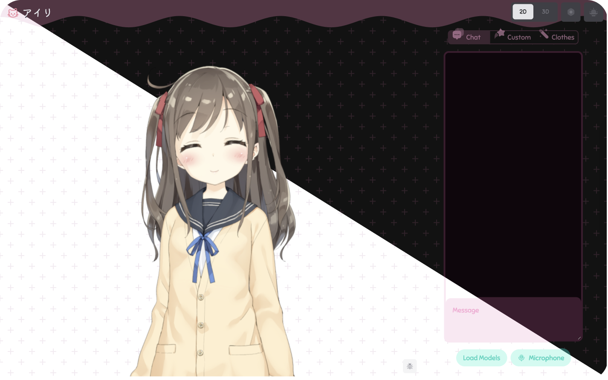
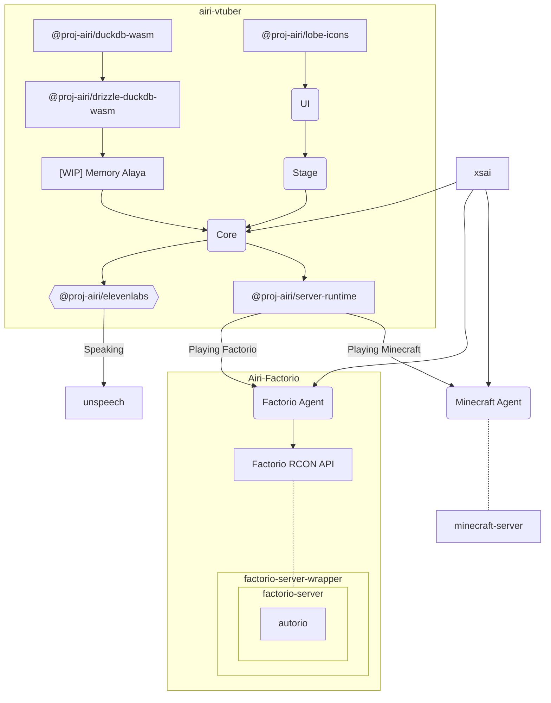
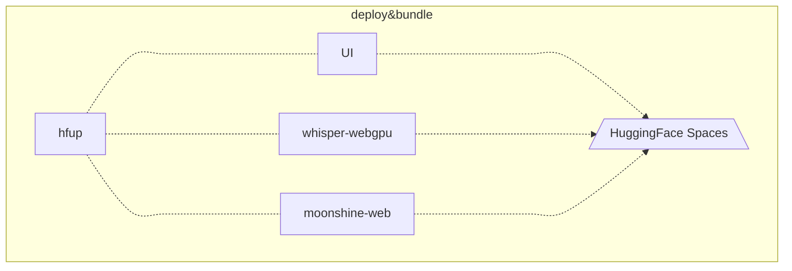

<p align="center">
  
</p>

<h1 align="center">アイリ VTuber</h1>

<p align="center">
  [<a href="https:///airi.ayaka.io">Try it</a>] [<a href="https://github.com/moeru-ai/airi/blob/main/README.zh-CN.md">简体中文文档</a>]
</p>

> Heavily inspired by [Neuro-sama](https://www.youtube.com/@Neurosama)

## Current progress

Capable of

- [x] Brain
  - [x] Play [Minecraft](https://www.minecraft.net)
  - [ ] Play [Factorio](https://www.factorio.com) (WIP, but [PoC and demo available](https://github.com/moeru-ai/airi-factorio))
  - [x] Chat in [Telegram](https://telegram.org)
  - [x] Chat in [Discord](https://discord.com)
- [x] Ears
  - [x] Audio input from browser
  - [x] Audio input from [Discord](https://discord.com)
  - [x] Client side speech recognition
  - [x] Client side talking detection
- [x] Mouth
  - [x] ElevenLabs voice synthesis
- [x] Body
  - [x] VRM support
    - [x] Control VRM model
  - [x] VRM model animations
    - [x] Auto blink
    - [x] Auto look at
    - [x] Idle eye movement
  - [x] Live2D support
    - [x] Control Live2D model
  - [x] Live2D model animations
    - [x] Auto blink
    - [x] Auto look at
    - [x] Idle eye movement

## Development

```shell
pnpm i
```

```shell
pnpm dev
```

## Sub-projects born from this project

- [`unspeech`](https://github.com/moeru-ai/unspeech): Universal endpoint proxy server for `/audio/transcriptions` and `/audio/speech`, like LiteLLM but for any ASR and TTS
- [`hfup`](https://github.com/moeru-ai/airi/tree/main/packages/hfup): tools to help on deploying, bundling to HuggingFace Spaces
- [`@proj-airi/drizzle-duckdb-wasm`](https://github.com/moeru-ai/airi/tree/main/packages/drizzle-duckdb-wasm/README.md): Drizzle ORM driver for DuckDB WASM
- [`@proj-airi/duckdb-wasm`](https://github.com/moeru-ai/airi/tree/main/packages/duckdb-wasm/README.md): Easy to use wrapper for `@duckdb/duckdb-wasm`
- [`@proj-airi/lobe-icons`](https://github.com/moeru-ai/airi/tree/main/packages/lobe-icons): Iconify JSON bundle for amazing AI & LLM icons from [lobe-icons](https://github.com/lobehub/lobe-icons), support Tailwind and UnoCSS
- [`@proj-airi/elevenlabs`](https://github.com/moeru-ai/airi/tree/main/packages/elevenlabs): TypeScript definitions for ElevenLabs API
- [Airi Factorio](https://github.com/moeru-ai/airi-factorio): Allow Airi to play Factorio
- [Factorio RCON API](https://github.com/nekomeowww/factorio-rcon-api): RESTful API wrapper for Factorio headless server console
- [`autorio`](https://github.com/moeru-ai/airi-factorio/tree/main/packages/autorio): Factorio automation library
- [`tstl-plugin-reload-factorio-mod](https://github.com/moeru-ai/airi-factorio/tree/main/packages/tstl-plugin-reload-factorio-mod): Reload Factorio mod when developing
- [🥺 SAD](https://github.com/moeru-ai/sad): Documentation and notes for self-host and browser running LLMs





## Models used

- [onnx-community/whisper-large-v3-turbo · Hugging Face](https://huggingface.co/onnx-community/whisper-large-v3-turbo)

## Similar Projects

- [SugarcaneDefender/z-waif](https://github.com/SugarcaneDefender/z-waif): Great at gaming, autonomous, and prompt engineering
- [semperai/amica](https://github.com/semperai/amica/): Great at VRM, WebXR
- [elizaOS/eliza](https://github.com/elizaOS/eliza): Great examples and software engineering on how to integrate agent into various of systems and APIs
- [ardha27/AI-Waifu-Vtuber](https://github.com/ardha27/AI-Waifu-Vtuber): Great about Twitch API integrations
- [InsanityLabs/AIVTuber](https://github.com/InsanityLabs/AIVTuber): Nice UI and UX
- [IRedDragonICY/vixevia](https://github.com/IRedDragonICY/vixevia)
- [t41372/Open-LLM-VTuber](https://github.com/t41372/Open-LLM-VTuber)
- [PeterH0323/Streamer-Sales](https://github.com/PeterH0323/Streamer-Sales)

## Acknowledgements

- [pixiv/ChatVRM](https://github.com/pixiv/ChatVRM)
- [josephrocca/ChatVRM-js: A JS conversion/adaptation of parts of the ChatVRM (TypeScript) code for standalone use in OpenCharacters and elsewhere](https://github.com/josephrocca/ChatVRM-js)
- Design of UI and style was inspired by [Cookard](https://store.steampowered.com/app/2919650/Cookard/), [UNBEATABLE](https://store.steampowered.com/app/2240620/UNBEATABLE/), and [Sensei! I like you so much!](https://store.steampowered.com/app/2957700/_/), and artworks of [Ayame by Mercedes Bazan](https://dribbble.com/shots/22157656-Ayame) with [Wish by Mercedes Bazan](https://dribbble.com/shots/24501019-Wish)
- [mallorbc/whisper_mic](https://github.com/mallorbc/whisper_mic)
- [`xsai`](https://github.com/moeru-ai/xsai): Implemented a decent amount of packages to interact with LLMs and models, like [Vercel AI SDK](https://sdk.vercel.ai/) but a lot more smaller.
