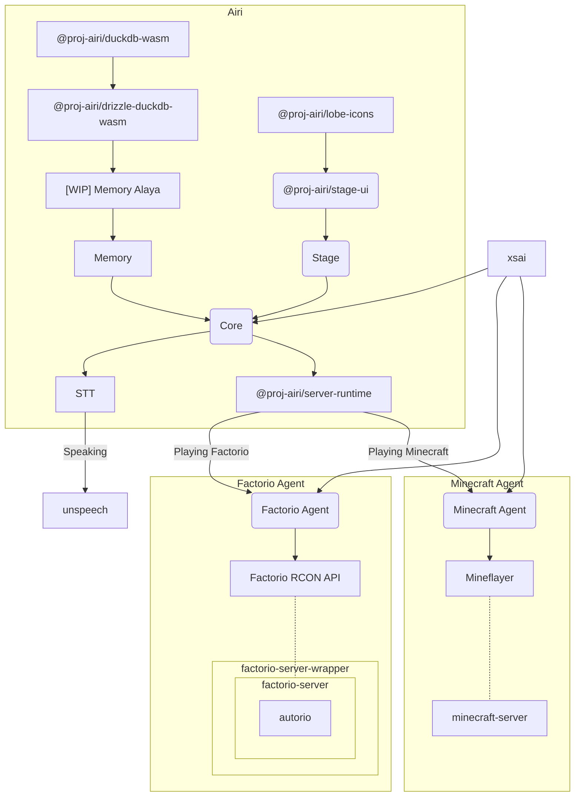
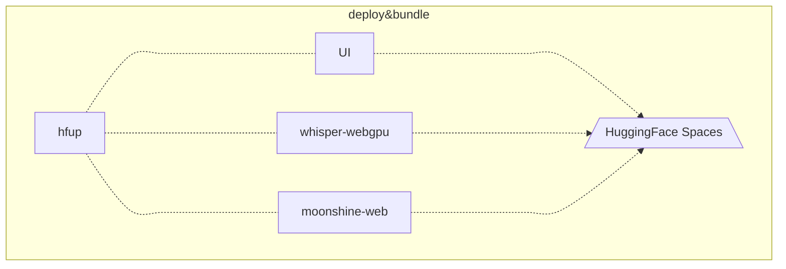

<p align="center">
  
</p>

<h1 align="center">アイリ VTuber</h1>

<p align="center">
  [<a href="https://airi.moeru.ai">试试看</a>] [<a href="https://github.com/moeru-ai/airi">English Docs</a>]
</p>

> 深受 [Neuro-sama](https://www.youtube.com/@Neurosama) 启发

## 当前进度

能够

- [x] 大脑
  - [x] 玩 [Minecraft](https://www.minecraft.net)
  - [ ] 玩 [Factorio](https://www.factorio.com) (WIP, 但 [PoC 和演示可用](https://github.com/moeru-ai/airi-factorio))
  - [x] 在 [Telegram](https://telegram.org) 聊天
  - [x] 在 [Discord](https://discord.com) 聊天
- [x] 耳朵
  - [x] 浏览器音频输入
  - [x] [Discord](https://discord.com) 音频输入
  - [x] 客户端端语音识别
  - [x] 客户端端说话检测
- [x] 嘴巴
  - [x] ElevenLabs 语音合成
- [x] 身体
  - [x] VRM 支持
    - [x] 控制 VRM 模型
  - [x] VRM 模型动画
    - [x] 自动眨眼
    - [x] 自动看
    - [x] 空闲眼睛移动
  - [x] Live2D 支持
    - [x] 控制 Live2D 模型
  - [x] Live2D 模型动画
    - [x] 自动眨眼
    - [x] 自动看
    - [x] 空闲眼睛移动

## 开发

```shell
pnpm i
```

```shell
pnpm dev
```

## 原生支持的 LLM API 提供商列表（由 [xsai](https://github.com/moeru-ai/xsai) 驱动）

- [x] [OpenRouter](https://openrouter.ai/)
- [x] [vLLM](https://github.com/vllm-project/vllm)
- [x] [SGLang](https://github.com/sgl-project/sglang)
- [x] [Ollama](https://github.com/ollama/ollama)
- [x] [Google Gemini](https://developers.generativeai.google)
- [x] [OpenAI](https://platform.openai.com/docs/guides/gpt/chat-completions-api)
  - [ ] [Azure OpenAI API](https://learn.microsoft.com/en-us/azure/ai-services/openai/reference)
- [x] [Anthropic Claude](https://anthropic.com)
  - [ ] [AWS Claude](https://learn.microsoft.com/en-us/azure/ai-services/openai/reference)
- [x] [深度求索 DeepSeek](https://www.deepseek.com/)
- [x] [通义千问 Qwen](https://help.aliyun.com/document_detail/2400395.html)
- [x] [xAI](https://x.ai/)
- [x] [Groq](https://wow.groq.com/)
- [x] [Mistral](https://mistral.ai/)
- [x] [Cloudflare Workers AI](https://developers.cloudflare.com/workers-ai/)
- [x] [Together.ai](https://www.together.ai/)
- [x] [Fireworks.ai](https://www.together.ai/)
- [x] [Novita](https://www.novita.ai/)
- [x] [智谱](https://bigmodel.cn)
- [x] [硅基流动](https://cloud.siliconflow.cn/i/rKXmRobW)
- [x] [阶跃星辰](https://platform.stepfun.com/)
- [x] [百川](https://platform.baichuan-ai.com)
- [x] [Minimax](https://api.minimax.chat/)
- [x] [月之暗面](https://platform.moonshot.cn/)
- [x] [腾讯混元](https://cloud.tencent.com/document/product/1729)
- [ ] [讯飞星火](https://www.xfyun.cn/doc/spark/Web.html)
- [ ] [火山引擎（豆包）](https://www.volcengine.com/experience/ark?utm_term=202502dsinvite&ac=DSASUQY5&rc=2QXCA1VI)

## 从这个项目诞生的子项目

- [`unspeech`](https://github.com/moeru-ai/unspeech): 用于代理 `/audio/transcriptions` 和 `/audio/speech` 的代理服务器实现，类似 LiteLLM 但面向任何 ASR 和 TTS
- [`hfup`](https://github.com/moeru-ai/airi/tree/main/packages/hfup): 帮助部署、打包到 HuggingFace Spaces 的工具集
- [`@proj-airi/drizzle-duckdb-wasm`](https://github.com/moeru-ai/airi/tree/main/packages/drizzle-duckdb-wasm/README.md): DuckDB WASM 的 Drizzle ORM driver 驱动
- [`@proj-airi/duckdb-wasm`](https://github.com/moeru-ai/airi/tree/main/packages/duckdb-wasm/README.md): 让 `@duckdb/duckdb-wasm` 更好用的封装
- [`@proj-airi/lobe-icons`](https://github.com/moeru-ai/airi/tree/main/packages/lobe-icons): 为 [lobe-icons](https://github.com/lobehub/lobe-icons) 漂亮的 AI & LLM 图标制作的 Iconify JSON 封装，支持 Tailwind 和 UnoCSS
- [`@proj-airi/elevenlabs`](https://github.com/moeru-ai/airi/tree/main/packages/elevenlabs): ElevenLabs API 的 TypeScript 定义
- [Airi Factorio](https://github.com/moeru-ai/airi-factorio): 允许 Airi 玩耍 Factorio
- [Factorio RCON API](https://github.com/nekomeowww/factorio-rcon-api): Factorio 无头服务器控制台的 RESTful API 封装
- [`autorio`](https://github.com/moeru-ai/airi-factorio/tree/main/packages/autorio): Factorio 自动化库
- [`tstl-plugin-reload-factorio-mod](https://github.com/moeru-ai/airi-factorio/tree/main/packages/tstl-plugin-reload-factorio-mod): 开发时支持热重载 Factorio 模组
- [🥺 SAD](https://github.com/moeru-ai/sad): 自托管和浏览器运行 LLM 的文档和说明





## 使用的模型

- [onnx-community/whisper-large-v3-turbo · Hugging Face](https://huggingface.co/onnx-community/whisper-large-v3-turbo)

## 类似项目

- [SugarcaneDefender/z-waif](https://github.com/SugarcaneDefender/z-waif): Great at gaming, autonomous, and prompt engineering
- [semperai/amica](https://github.com/semperai/amica/): Great at VRM, WebXR
- [elizaOS/eliza](https://github.com/elizaOS/eliza): Great examples and software engineering on how to integrate agent into various of systems and APIs
- [ardha27/AI-Waifu-Vtuber](https://github.com/ardha27/AI-Waifu-Vtuber): Great about Twitch API integrations
- [InsanityLabs/AIVTuber](https://github.com/InsanityLabs/AIVTuber): Nice UI and UX
- [IRedDragonICY/vixevia](https://github.com/IRedDragonICY/vixevia)
- [t41372/Open-LLM-VTuber](https://github.com/t41372/Open-LLM-VTuber)
- [PeterH0323/Streamer-Sales](https://github.com/PeterH0323/Streamer-Sales)

## 鸣谢

- [pixiv/ChatVRM](https://github.com/pixiv/ChatVRM)
- [josephrocca/ChatVRM-js: A JS conversion/adaptation of parts of the ChatVRM (TypeScript) code for standalone use in OpenCharacters and elsewhere](https://github.com/josephrocca/ChatVRM-js)
- UI 和样式的设计受 [Cookard](https://store.steampowered.com/app/2919650/Cookard/)，[UNBEATABLE](https://store.steampowered.com/app/2240620/UNBEATABLE/)，以及 [Sensei! I like you so much!](https://store.steampowered.com/app/2957700/_/)，还有 [Ayame by Mercedes Bazan](https://dribbble.com/shots/22157656-Ayame) 和 [Wish by Mercedes Bazan](https://dribbble.com/shots/24501019-Wish) 的作品启发
- [mallorbc/whisper_mic](https://github.com/mallorbc/whisper_mic)
- [`xsai`](https://github.com/moeru-ai/xsai)：实现了相当数量的包来与 LLM 和模型交互，像 [Vercel AI SDK](https://sdk.vercel.ai/) 但是更小
