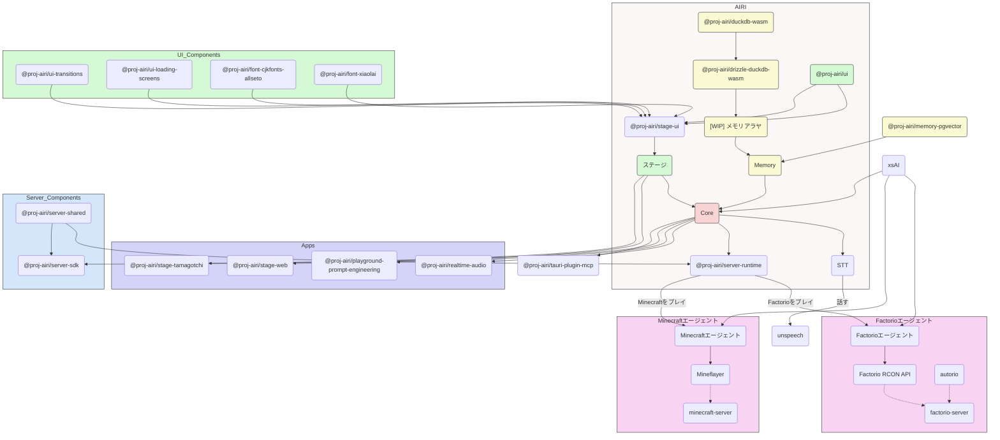

<picture>
  <source
    width="100%"
    srcset="./content/public/banner-dark-1280x640.avif"
    media="(prefers-color-scheme: dark)"
  />
  <source
    width="100%"
    srcset="./content/public/banner-light-1280x640.avif"
    media="(prefers-color-scheme: light), (prefers-color-scheme: no-preference)"
  />
  
</picture>

<h1 align="center">Project AIRI</h1>

<p align="center">モデル駆動の魂の容器、ちょっとしたことができるデスクペット。</p>
<p align="center">Neuro-samaのようなバーチャルペアも私たちの世界の一部にしましょう！</p>

<p align="center">
  [<a href="https://discord.gg/TgQ3Cu2F7A">Discordサーバーに参加する</a>] [<a href="https:///airi.moeru.ai">試してみる</a>] [<a href="https://github.com/moeru-ai/airi/blob/main/README.md">English</a>] [<a href="https://github.com/moeru-ai/airi/blob/main/docs/README.zh-CN.md">简体中文</a>]
</p>

<p align="center">
  <a href="https://deepwiki.com/moeru-ai/airi"></a>
  <a href="https://github.com/moeru-ai/airi/blob/main/LICENSE"></a>
  <a href="https://discord.gg/TgQ3Cu2F7A"></a>
  <a href="https://x.com/proj_airi"></a>
  <a href="https://t.me/+7M_ZKO3zUHFlOThh"></a>
</p>

<p align="center">
  <a href="https://www.producthunt.com/products/airi?embed=true&utm_source=badge-featured&utm_medium=badge&utm_source=badge-airi" target="_blank"></a>
  <a href="https://trendshift.io/repositories/14636" target="_blank"></a>
</p>

> [Neuro-sama](https://www.youtube.com/@Neurosama) に大きな影響を受けました

> [!WARNING]
> **ご注意：**
> 当プロジェクトでは、公式の暗号通貨やトークン等は**一切発行しておりません**。誤情報などにご注意ください。

> [!NOTE]
>
> Project AIRIから生まれたすべてのサブプロジェクト用に、専用の組織[@proj-airi](https://github.com/proj-airi)があります。ぜひチェックしてみてください！
>
> RAG、メモリシステム、組み込みデータベース、アイコン、Live2Dユーティリティなど多数あります！

# サイバー生命体（サイバーワイフ/ハズバンド、デジタルペット）や、あなたと遊んだり話したりできるデジタルコンパニオンを持つことを夢見たことはありますか？

[ChatGPT](https://chatgpt.com)や有名な[Claude](https://claude.ai)のような最新の大規模言語モデルの力を借りて、仮想存在に役割演技やチャットを求めることは、すでに誰にとっても十分簡単になっています。[Character.ai（別名c.ai）](https://character.ai)や[JanitorAI](https://janitorai.com/)のようなプラットフォーム、そして[SillyTavern](https://github.com/SillyTavern/SillyTavern)のようなローカルな遊び場は、チャットベースや視覚的なアドベンチャーゲームのような体験のための十分な解決策となっています。

> しかし、ゲームをプレイする能力はどうでしょうか？あなたがコーディングしているものを見たり、ゲームをしながらチャットしたり、ビデオを見たり、他の多くのことができる能力は？

おそらく[Neuro-sama](https://www.youtube.com/@Neurosama)をすでに知っているでしょう。彼女は現在、ゲームをプレイし、チャットし、あなたや参加者（VTuberコミュニティ内）と対話できる最高のコンパニオンです。この種の存在を「デジタルヒューマン」と呼ぶ人もいます。**残念ながら、オープンソースではないため、ライブストリームがオフラインになった後は彼女と対話することはできません**。

そのため、このプロジェクトAIRIは、ここで別の可能性を提供します：**簡単に、どこでも、いつでも、あなた自身のデジタルライフ、サイバー生活を所有できるようにします**。

## このプロジェクトの特別な点は何ですか？

他のAI駆動のVTuberオープンソースプロジェクトとは異なり、アイリVTuberは開発初日から[WebGPU](https://www.w3.org/TR/webgpu/)、[WebAudio](https://developer.mozilla.org/en-US/docs/Web/API/Web_Audio_API)、[Web Workers](https://developer.mozilla.org/en-US/docs/Web/API/Web_Workers_API/Using_web_workers)、[WebAssembly](https://webassembly.org/)、[WebSocket](https://developer.mozilla.org/en-US/docs/Web/API/WebSocket)などの多くのWeb技術をサポートしています。

これは、**アイリVTuberが現代のブラウザやデバイスで動作可能である**ことを意味し、モバイルデバイスでも動作します（PWAサポート済み）。これにより、私たち（開発者）はアイリVTuberの力を次のレベルに引き上げるための多くの可能性を持ちつつ、ユーザーがTCP接続や他の非Web技術を必要とする機能を有効にする柔軟性を残しています。例えば、Discordのボイスチャネルに接続したり、MinecraftやFactorioを友達と一緒にプレイすることができます。

> [!NOTE]
>
> 私たちはまだ開発の初期段階にあり、才能ある開発者を探しています。アイリVTuberを現実のものにするために私たちを助けてください。
>
> Vue.js、TypeScript、またはこのプロジェクトに必要な開発ツールに慣れていなくても大丈夫です。アーティスト、デザイナー、または最初のライブストリームを立ち上げる手助けをすることもできます。
>
> ReactやSvelte、Solidの大ファンであっても歓迎します。アイリVTuberに見たい機能を追加したり、実験したい機能を追加するためのサブディレクトリを開くことができます。
>
> 私たちが探している分野（および関連プロジェクト）：
>
> - Live2Dモデラー
> - VRMモデラー
> - VRChatアバターデザイナー
> - コンピュータビジョン
> - 強化学習
> - 音声認識
> - 音声合成
> - ONNXランタイム
> - Transformers.js
> - vLLM
> - WebGPU
> - Three.js
> - WebXR（@moeru-ai組織の[別のプロジェクト](https://github.com/moeru-ai/chat)もチェックしてください）
>
> **興味があるなら、ここで自己紹介してみませんか？ [Would like to join part of us to build AIRI?](https://github.com/moeru-ai/airi/discussions/33)**

## 現在の進捗


可能なこと

- [x] 脳
  - [x] [Minecraft](https://www.minecraft.net)をプレイ
  - [x] [Factorio](https://www.factorio.com)をプレイ（進行中ですが、[PoCとデモが利用可能](https://github.com/moeru-ai/airi-factorio)）
  - [x] [Telegram](https://telegram.org)でチャット
  - [x] [Discord](https://discord.com)でチャット
  - [ ] メモリ
    - [x] ブラウザ内データベースサポート（DuckDB WASM | `pglite`）
    - [ ] メモリアラヤ（進行中）
  - [ ] ブラウザ内ローカル（WebGPU）推論
- [x] 耳
  - [x] ブラウザからの音声入力
  - [x] [Discord](https://discord.com)からの音声入力
  - [x] クライアント側の音声認識
  - [x] クライアント側の話し声検出
- [x] 口
  - [x] [ElevenLabs](https://elevenlabs.io/)音声合成
- [x] 体
  - [x] VRMサポート
    - [x] VRMモデルの制御
  - [x] VRMモデルのアニメーション
    - [x] 自動まばたき
    - [x] 自動視線追従
    - [x] アイドル時の目の動き
  - [x] Live2Dサポート
    - [x] Live2Dモデルの制御
  - [x] Live2Dモデルのアニメーション
    - [x] 自動まばたき
    - [x] 自動視線追従
    - [x] アイドル時の目の動き

## 開発

> このプロジェクトの詳細な開発手順については、[CONTRIBUTING.md](../.github/CONTRIBUTING.md)を参照してください

> [!NOTE]
> デフォルトでは `pnpm dev`はステージウェブ（ブラウザ版）の開発サーバーを起動します。
> デスクトップ版の開発を試したい場合は、[CONTRIBUTING.md](../.github/CONTRIBUTING.md)を読んで環境を正し
> くセットアップしてください。

```shell
pnpm i
pnpm dev
```

### ステージウェブ（ブラウザ版）

```shell
pnpm dev
```

### ステージたまごっち（デスクトップアプリ）

```shell
pnpm dev:tamagotchi
```

### ドキュメントサイト

```shell
pnpm dev:docs
```

## サポートされているLLM APIプロバイダー（[xsai](https://github.com/moeru-ai/xsai)によって提供）

- [x] [OpenRouter](https://openrouter.ai/)
- [x] [vLLM](https://github.com/vllm-project/vllm)
- [x] [SGLang](https://github.com/sgl-project/sglang)
- [x] [Ollama](https://github.com/ollama/ollama)
- [x] [Google Gemini](https://developers.generativeai.google)
- [x] [OpenAI](https://platform.openai.com/docs/guides/gpt/chat-completions-api)
  - [ ] [Azure OpenAI API](https://learn.microsoft.com/en-us/azure/ai-services/openai/reference)（PR歓迎）
- [x] [Anthropic Claude](https://anthropic.com)
  - [ ] [AWS Claude](https://learn.microsoft.com/en-us/azure/ai-services/openai/reference)（PR歓迎）
- [x] [DeepSeek](https://www.deepseek.com/)
- [x] [Qwen](https://help.aliyun.com/document_detail/2400395.html)
- [x] [xAI](https://x.ai/)
- [x] [Groq](https://wow.groq.com/)
- [x] [Mistral](https://mistral.ai/)
- [x] [Cloudflare Workers AI](https://developers.cloudflare.com/workers-ai/)
- [x] [Together.ai](https://www.together.ai/)
- [x] [Fireworks.ai](https://www.together.ai/)
- [x] [Novita](https://www.novita.ai/)
- [x] [Zhipu](https://bigmodel.cn)
- [x] [SiliconFlow](https://cloud.siliconflow.cn/i/rKXmRobW)
- [x] [Stepfun](https://platform.stepfun.com/)
- [x] [Baichuan](https://platform.baichuan-ai.com)
- [x] [Minimax](https://api.minimax.chat/)
- [x] [Moonshot AI](https://platform.moonshot.cn/)
- [x] [Player2](https://player2.game/)
- [x] [Tencent Cloud](https://cloud.tencent.com/document/product/1729)
- [ ] [Sparks](https://www.xfyun.cn/doc/spark/Web.html)（PR歓迎）
- [ ] [Volcano Engine](https://www.volcengine.com/experience/ark?utm_term=202502dsinvite&ac=DSASUQY5&rc=2QXCA1VI)（PR歓迎）

## このプロジェクトから生まれたサブプロジェクト

- [Awesome AI VTuber](https://github.com/proj-airi/awesome-ai-vtuber): AI VTuberと関連プロジェクトのキュレーションリスト
- [`unspeech`](https://github.com/moeru-ai/unspeech): `/audio/transcriptions`と`/audio/speech`のためのユニバーサルエンドポイントプロキシサーバー、LiteLLMのように、任意のASRとTTSに対応
- [`hfup`](https://github.com/moeru-ai/hfup): HuggingFace Spacesへのデプロイとバンドルを支援するツール
- [`xsai-transformers`](https://github.com/moeru-ai/xsai-transformers): [xsAI](https://github.com/moeru-ai/xsai)のための実験的な[🤗 Transformers.js](https://github.com/huggingface/transformers.js)プロバイダー
- [WebAI: Realtime Voice Chat](https://github.com/proj-airi/webai-realtime-voice-chat): VAD + STT + LLM + TTSを使用してChatGPTのリアルタイム音声をゼロから実装する完全な例
- [`@proj-airi/drizzle-duckdb-wasm`](https://github.com/moeru-ai/airi/tree/main/packages/drizzle-duckdb-wasm/README.md): DuckDB WASMのDrizzle ORMドライバー
- [`@proj-airi/duckdb-wasm`](https://github.com/moeru-ai/airi/tree/main/packages/duckdb-wasm/README.md): `@duckdb/duckdb-wasm`の使いやすいラッパー
- [AIRI Factorio](https://github.com/moeru-ai/airi-factorio): AIRIがFactorioをプレイできるようにする
- [Factorio RCON API](https://github.com/nekomeowww/factorio-rcon-api): FactorioヘッドレスサーバーコンソールのRESTful APIラッパー
- [`autorio`](https://github.com/moeru-ai/airi-factorio/tree/main/packages/autorio): Factorio自動化ライブラリ
- [`tstl-plugin-reload-factorio-mod`](https://github.com/moeru-ai/airi-factorio/tree/main/packages/tstl-plugin-reload-factorio-mod): Factorioモッドの開発時にリロードをサポート
- [Velin](https://github.com/luoling8192/velin): Vue SFCとMarkdownを使用してLLMのための管理しやすい状態のプロンプトを書く
- [`demodel`](https://github.com/moeru-ai/demodel): さまざまな推論ランタイムからモデルやデータセットをデプロイ、バンドルするためのツール
- [`inventory`](https://github.com/moeru-ai/inventory): 中央集権的なモデルカタログとデフォルトプロバイダー設定のバックエンドサービス
- [MCP Launcher](https://github.com/moeru-ai/mcp-launcher): すべての可能なMCPサーバーのための簡単に使用できるMCPビルダー＆ランチャー、Ollamaのようにモデルのためのもの！
- [🥺 SAD](https://github.com/moeru-ai/sad): 自己ホストおよびブラウザで実行されるLLMのためのドキュメントとノート



## 類似プロジェクト

### オープンソースのもの

- [kimjammer/Neuro: A recreation of Neuro-Sama originally created in 7 days.](https://github.com/kimjammer/Neuro): 非常に完成度の高い実装
- [SugarcaneDefender/z-waif](https://github.com/SugarcaneDefender/z-waif): ゲーム、自律エージェント、プロンプトエンジニアリングに優れています
- [semperai/amica](https://github.com/semperai/amica/): VRM、WebXRに優れています
- [elizaOS/eliza](https://github.com/elizaOS/eliza): エージェントをさまざまなシステムやAPIに統合するための優れた例
- [ardha27/AI-Waifu-Vtuber](https://github.com/ardha27/AI-Waifu-Vtuber): Twitch APIの統合に優れています
- [InsanityLabs/AIVTuber](https://github.com/InsanityLabs/AIVTuber): 素晴らしいUIとUX
- [IRedDragonICY/vixevia](https://github.com/IRedDragonICY/vixevia)
- [t41372/Open-LLM-VTuber](https://github.com/t41372/Open-LLM-VTuber)
- [PeterH0323/Streamer-Sales](https://github.com/PeterH0323/Streamer-Sales)

### 非オープンソースのもの

- https://clips.twitch.tv/WanderingCaringDeerDxCat-Qt55xtiGDSoNmDDr https://www.youtube.com/watch?v=8Giv5mupJNE
- https://clips.twitch.tv/TriangularAthleticBunnySoonerLater-SXpBk1dFso21VcWD

## プロジェクトのステータス


## 謝辞

- [Reka UI](https://github.com/unovue/reka-ui): ドキュメントサイトのデザイン、新しいランディングページはこれに基づいており、また膨大な量のUIコンポーネントを実装してくれたことに感謝します。（shadcn-vueはReka UIをヘッドレスとして使用していますので、ぜひチェックしてください！）
- [pixiv/ChatVRM](https://github.com/pixiv/ChatVRM)
- [josephrocca/ChatVRM-js: A JS conversion/adaptation of parts of the ChatVRM (TypeScript) code for standalone use in OpenCharacters and elsewhere](https://github.com/josephrocca/ChatVRM-js)
- UIとスタイルのデザインは、[Cookard](https://store.steampowered.com/app/2919650/Cookard/)、[UNBEATABLE](https://store.steampowered.com/app/2240620/UNBEATABLE/)、および[Sensei! I like you so much!](https://store.steampowered.com/app/2957700/_/)の作品、[Ayame by Mercedes Bazan](https://dribbble.com/shots/22157656-Ayame)と[Wish by Mercedes Bazan](https://dribbble.com/shots/24501019-Wish)のアートワークに触発されました
- [mallorbc/whisper_mic](https://github.com/mallorbc/whisper_mic)
- [`xsai`](https://github.com/moeru-ai/xsai): LLMやモデルと対話するための多くのパッケージを実装しました。 [Vercel AI SDK](https://sdk.vercel.ai/)のように小さなものです。

## スター履歴

[](https://www.star-history.com/#moeru-ai/airi&Date)
