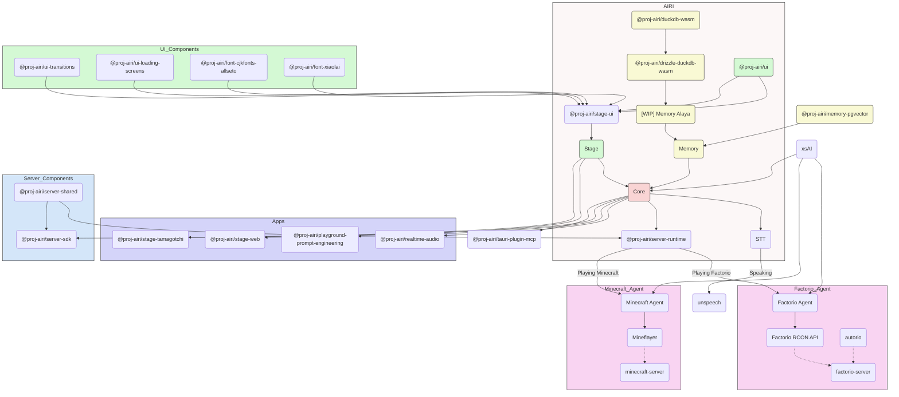

<picture>
  <source
    width="100%"
    srcset="./content/public/banner-dark-1280x640.avif"
    media="(prefers-color-scheme: dark)"
  />
  <source
    width="100%"
    srcset="./content/public/banner-light-1280x640.avif"
    media="(prefers-color-scheme: light), (prefers-color-scheme: no-preference)"
  />
  
</picture>

<h1 align="center">Проект AIRI</h1>

<p align="center">Воссоздание Neuro-sama, контейнера души для AI waifu / виртуальных персонажей, чтобы привести их в наш мир.</p>

<p align="center">
  [<a href="https://discord.gg/TgQ3Cu2F7A">Присоединиться к серверу Discord</a>] [<a href="https:///airi.moeru.ai">Попробовать</a>] [<a href="https://github.com/moeru-ai/airi/blob/main/docs/README.zh-CN.md">简体中文</a>] [<a href="https://github.com/moeru-ai/airi/blob/main/docs/README.ja-JP.md">日本語</a>] [<a href="https://github.com/moeru-ai/airi/blob/main/README.md">English</a>]
</p>

<p align="center">
  <a href="https://deepwiki.com/moeru-ai/airi"></a>
  <a href="https://github.com/moeru-ai/airi/blob/main/LICENSE"></a>
  <a href="https://discord.gg/TgQ3Cu2F7A"></a>
  <a href="https://x.com/proj_airi"></a>
  <a href="https://t.me/+7M_ZKO3zUHFlOThh"></a>
</p>

<p align="center">
  <a href="https://www.producthunt.com/products/airi?embed=true&utm_source=badge-featured&utm_medium=badge&utm_source=badge-airi" target="_blank"></a>
  <a href="https://trendshift.io/repositories/14636" target="_blank"></a>
</p>
<strong>Руководство от сообщества:</strong> Для более подробного пошагового руководства по настройке, включая получение ключей API и настройку среды, ознакомьтесь с этим замечательным <a href="https://docs.google.com/document/d/1AGs3Br_6mMbyQykbmSilczg4I56U6LTO-E9D3_Szk_I/edit?tab=t.0">руководством, написанным сообществом</a>.</p>
> Сильно вдохновлено [Neuro-sama](https://www.youtube.com/@Neurosama)

> [!WARNING]
> **Внимание:** У нас **нет** официально выпущенной криптовалюты или токена, связанного с этим проектом. Пожалуйста, проверяйте информацию и действуйте с осторожностью.

> [!NOTE]
>
> У нас есть целая выделенная организация [@proj-airi](https://github.com/proj-airi) для всех подпроектов, родившихся из Проекта AIRI. Проверьте её!
>
> RAG, система памяти, встроенная база данных, иконки, утилиты Live2D и многое другое!
Вы когда-нибудь мечтали о кибер-живом существе (кибер-вайфу / хазбандо, цифровом питомце) или цифровом компаньоне, который мог бы играть с вами и разговаривать?

С силой современных больших языковых моделей, таких как [ChatGPT](https://chatgpt.com) и знаменитый [Claude](https://claude.ai), попросить виртуальное существо ролеплей и общаться с нами уже достаточно просто для всех. Платформы вроде [Character.ai (a.k.a. c.ai)](https://character.ai) и [JanitorAI](https://janitorai.com/), а также локальные площадки вроде [SillyTavern](https://github.com/SillyTavern/SillyTavern) уже являются достаточно хорошими решениями для чат-основанного или визуального опыта, похожего на приключенческую игру.

> Но что насчёт способностей играть в игры? И видеть, что вы кодите? Общаться во время игр, просмотра видео и способности делать многое другое.

Возможно, вы уже знаете [Neuro-sama](https://www.youtube.com/@Neurosama). Она в настоящее время является лучшим виртуальным стримером, способным играть в игры, общаться и взаимодействовать с вами и участниками. Некоторые также называют такое существо "цифровым человеком". **К сожалению, поскольку это не с открытым исходным кодом, вы не можете взаимодействовать с ней после того, как её прямые трансляции заканчиваются**.

Поэтому этот проект, AIRI, предлагает здесь другую возможность: **позволить вам владеть своей цифровой жизнью, кибер-жизнью, легко, везде, в любое время**.

## Журналы разработки, которые мы опубликовали, и последние обновления

- [DevLog @ 2025.07.18](https://airi.moeru.ai/docs/blog/DevLog-2025.07.18/) от 18 июля 2025 г.
- [DreamLog 0x1](https://airi.moeru.ai/docs/blog/dreamlog-0x1/) от 16 июня 2025 г.
- [DevLog @ 2025.06.08](https://airi.moeru.ai/docs/blog/DevLog-2025.06.08/) от 8 июня 2025 г.
- [DevLog @ 2025.05.16](https://airi.moeru.ai/docs/blog/DevLog-2025.05.16/) от 16 мая 2025 г.
- ...больше на [сайте документации](https://airi.moeru.ai/docs)

## Что такого особенного в этом проекте?

В отличие от других открытых проектов AI-управляемых VTuber, アイリ был построен с поддержкой многих веб-технологий, таких как [WebGPU](https://www.w3.org/TR/webgpu/), [WebAudio](https://developer.mozilla.org/en-US/docs/Web/API/Web_Audio_API), [Web Workers](https://developer.mozilla.org/en-US/docs/Web/API/Web_Workers_API/Using_web_workers), [WebAssembly](https://webassembly.org/), [WebSocket](https://developer.mozilla.org/en-US/docs/Web/API/WebSocket) и т.д. с первого дня.

> [!TIP]
> Беспокоитесь о падении производительности из-за использования веб-технологий?
>
> Не беспокойтесь, хотя версия для веб-браузера предназначена для демонстрации того, насколько мы можем продвинуться внутри браузеров и веб-вью, мы никогда не будем полностью полагаться на это. Десктопная версия AIRI способна использовать нативные [NVIDIA CUDA](https://developer.nvidia.com/cuda-toolkit) и [Apple Metal](https://developer.apple.com/metal/) по умолчанию (благодаря HuggingFace и любимому проекту [candle](https://github.com/huggingface/candle)), без сложного управления зависимостями. Учитывая компромисс, она частично питается веб-технологиями для графики, макетов, анимаций и WIP-системы плагинов для всех, чтобы интегрировать вещи.

Это означает, что **アイリ способен работать в современных браузерах и устройствах** и даже на мобильных устройствах (уже сделано с поддержкой PWA). Это открывает множество возможностей для нас (разработчиков) для построения и расширения мощи アイリ VTuber на следующий уровень, при этом оставляя гибкость для пользователей включать функции, требующие TCP-соединений или других невеб-технологий, таких как подключение к голосовому каналу Discord или игра в Minecraft и Factorio с друзьями.

> [!NOTE]
>
> Мы всё ещё на ранней стадии разработки, где ищем талантливых разработчиков, чтобы присоединиться к нам и помочь сделать アイリ реальностью.
>
> Это нормально, если вы не знакомы с Vue.js, TypeScript и инструментами разработки, необходимыми для этого проекта, вы можете присоединиться к нам как художник, дизайнер или даже помочь запустить нашу первую прямую трансляцию.
>
> Даже если вы большой фанат React, Svelte или даже Solid, мы приветствуем вас. Вы можете открыть поддиректорию, чтобы добавить функции, которые вы хотите видеть в アイリ, или которые хотели бы поэкспериментировать.
>
> Области (и связанные проекты), которые мы ищем:
>
> - Моделлер Live2D
> - Моделлер VRM
> - Дизайнер аватаров VRChat
> - Компьютерное зрение
> - Обучение с подкреплением
> - Распознавание речи
> - Синтез речи
> - ONNX Runtime
> - Transformers.js
> - vLLM
> - WebGPU
> - Three.js
> - WebXR ([проверьте другой проект](https://github.com/moeru-ai/chat), который у нас есть в организации @moeru-ai)
>
> **Если вы заинтересованы, почему бы не представить себя здесь? [Хотите присоединиться к нам в создании AIRI？](https://github.com/moeru-ai/airi/discussions/33)**

## Текущий прогресс


Способен на

- [x] Мозг
  - [x] Играть в [Minecraft](https://www.minecraft.net)
  - [x] Играть в [Factorio](https://www.factorio.com) (WIP, но [PoC и демо доступны](https://github.com/moeru-ai/airi-factorio))
  - [x] Общаться в [Telegram](https://telegram.org)
  - [x] Общаться в [Discord](https://discord.com)
  - [ ] Память
    - [x] Полная поддержка базы данных в браузере (DuckDB WASM | `pglite`)
    - [ ] Memory Alaya (WIP)
  - [ ] Полностью локальный вывод в браузере (WebGPU)
- [x] Уши
  - [x] Аудиовход из браузера
  - [x] Аудиовход из [Discord](https://discord.com)
  - [x] Распознавание речи на стороне клиента
  - [x] Обнаружение речи на стороне клиента
- [x] Рот
  - [x] Синтез голоса [ElevenLabs](https://elevenlabs.io/)
- [x] Тело
  - [x] Поддержка VRM
    - [x] Управление моделью VRM
  - [x] Анимации модели VRM
    - [x] Автоматическое моргание
    - [x] Автоматический взгляд
    - [x] Движение глаз в состоянии покоя
  - [x] Поддержка Live2D
    - [x] Управление моделью Live2D
  - [x] Анимации модели Live2D
    - [x] Автоматическое моргание
    - [x] Автоматический взгляд
    - [x] Движение глаз в состоянии покоя

## Разработка

> Для подробных инструкций по разработке этого проекта следуйте [CONTRIBUTING.md](../.github/CONTRIBUTING.md)

> [!NOTE]
> По умолчанию `pnpm dev` запустит сервер разработки для Stage Web (версия для браузера).
> Если вы хотите попробовать разработку десктопной версии, пожалуйста, убедитесь,
> что вы прочитали [CONTRIBUTING.md](../.github/CONTRIBUTING.md), чтобы правильно настроить среду.

```shell
pnpm i
pnpm dev
```

### Stage Web (Версия для браузера на [airi.moeru.ai](https://airi.moeru.ai))

```shell
pnpm dev
```

### Stage Tamagotchi (Десктопная версия)

```shell
pnpm dev:tamagotchi
```

Включён пакет Nix для Tamagotchi. Чтобы запустить airi с Nix, сначала убедитесь, что включены flakes, затем выполните:

```shell
nix run github:moeru-ai/airi
```

### Сайт документации

```shell
pnpm dev:docs
```

### Публикация

Пожалуйста, обновите версию в `Cargo.toml` после выполнения `bumpp`:

```shell
npx bumpp --no-commit --no-tag
```

## Поддержка провайдеров LLM API (на базе [xsai](https://github.com/moeru-ai/xsai))

- [x] [OpenRouter](https://openrouter.ai/)
- [x] [vLLM](https://github.com/vllm-project/vllm)
- [x] [SGLang](https://github.com/sgl-project/sglang)
- [x] [Ollama](https://github.com/ollama/ollama)
- [x] [Google Gemini](https://developers.generativeai.google)
- [x] [OpenAI](https://platform.openai.com/docs/guides/gpt/chat-completions-api)
  - [ ] [Azure OpenAI API](https://learn.microsoft.com/en-us/azure/ai-services/openai/reference) (PR welcome)
- [x] [Anthropic Claude](https://anthropic.com)
  - [ ] [AWS Claude](https://docs.anthropic.com/en/api/claude-on-amazon-bedrock) (PR welcome)
- [x] [DeepSeek](https://www.deepseek.com/)
- [x] [Qwen](https://help.aliyun.com/document_detail/2400395.html)
- [x] [xAI](https://x.ai/)
- [x] [Groq](https://wow.groq.com/)
- [x] [Mistral](https://mistral.ai/)
- [x] [Cloudflare Workers AI](https://developers.cloudflare.com/workers-ai/)
- [x] [Together.ai](https://www.together.ai/)
- [x] [Fireworks.ai](https://www.together.ai/)
- [x] [Novita](https://www.novita.ai/)
- [x] [Zhipu](https://bigmodel.cn)
- [x] [SiliconFlow](https://cloud.siliconflow.cn/i/rKXmRobW)
- [x] [Stepfun](https://platform.stepfun.com/)
- [x] [Baichuan](https://platform.baichuan-ai.com)
- [x] [Minimax](https://api.minimax.chat/)
- [x] [Moonshot AI](https://platform.moonshot.cn/)
- [x] [Player2](https://player2.game/)
- [x] [Tencent Cloud](https://cloud.tencent.com/document/product/1729)
- [ ] [Sparks](https://www.xfyun.cn/doc/spark/Web.html) (PR welcome)
- [ ] [Volcano Engine](https://www.volcengine.com/experience/ark?utm_term=202502dsinvite&ac=DSASUQY5&rc=2QXCA1VI) (PR welcome)

## Подпроекты, родившиеся из этого проекта

- [Awesome AI VTuber](https://github.com/proj-airi/awesome-ai-vtuber): Курируемый список AI VTuber и связанных проектов
- [`unspeech`](https://github.com/moeru-ai/unspeech): Универсальный прокси-сервер конечной точки для `/audio/transcriptions` and `/audio/speech`, как LiteLLM, но для любого ASR и TTS
- [`hfup`](https://github.com/moeru-ai/hfup): Инструменты для помощи в развертывании, упаковке в HuggingFace Spaces
- [`xsai-transformers`](https://github.com/moeru-ai/xsai-transformers): Экспериментальный провайдер [🤗 Transformers.js](https://github.com/huggingface/transformers.js) для [xsAI](https://github.com/moeru-ai/xsai).
- [WebAI: Realtime Voice Chat](https://github.com/proj-airi/webai-realtime-voice-chat): Полный пример реализации реального времени голосового чата ChatGPT с нуля с VAD + STT + LLM + TTS.
- [`@proj-airi/drizzle-duckdb-wasm`](https://github.com/moeru-ai/airi/tree/main/packages/drizzle-duckdb-wasm/README.md): Драйвер Drizzle ORM для DuckDB WASM
- [`@proj-airi/duckdb-wasm`](https://github.com/moeru-ai/airi/tree/main/packages/duckdb-wasm/README.md): Простой обертка для `@duckdb/duckdb-wasm`
- [`tauri-plugin-mcp`](https://github.com/moeru-ai/airi/blob/main/crates/tauri-plugin-mcp/README.md): Плагин Tauri для взаимодействия с серверами MCP.
- [AIRI Factorio](https://github.com/moeru-ai/airi-factorio): Позволяет AIRI играть в Factorio
- [Factorio RCON API](https://github.com/nekomeowww/factorio-rcon-api): RESTful API-обертка для консоли headless-сервера Factorio
- [`autorio`](https://github.com/moeru-ai/airi-factorio/tree/main/packages/autorio): Библиотека автоматизации Factorio
- [`tstl-plugin-reload-factorio-mod`](https://github.com/moeru-ai/airi-factorio/tree/main/packages/tstl-plugin-reload-factorio-mod): Перезагрузка мода Factorio при разработке
- [Velin](https://github.com/luoling8192/velin): Использование Vue SFC и Markdown для написания легко управляемых стейтфул-промптов для LLM
- [`demodel`](https://github.com/moeru-ai/demodel): Легко ускорьте загрузку ваших моделей и датасетов из различных рантаймов вывода.
- [`inventory`](https://github.com/moeru-ai/inventory): Централизованный каталог моделей и бэкенд-сервис конфигураций провайдеров по умолчанию
- [MCP Launcher](https://github.com/moeru-ai/mcp-launcher): Простой в использовании конструктор и лаунчер MCP для всех возможных серверов MCP, как Ollama для моделей!
- [🥺 SAD](https://github.com/moeru-ai/sad): Документация и заметки для само-хостинга и запуска LLM в браузере.



## Похожие проекты

### С открытым исходным кодом

- [kimjammer/Neuro: A recreation of Neuro-Sama originally created in 7 days.](https://github.com/kimjammer/Neuro): очень качественная реализация.
- [SugarcaneDefender/z-waif](https://github.com/SugarcaneDefender/z-waif): Отлично в играх, автономности и инженерии промптов.
- [semperai/amica](https://github.com/semperai/amica/): Отлично в VRM, WebXR
- [elizaOS/eliza](https://github.com/elizaOS/eliza): Отличные примеры и инженерия ПО по интеграции агента в различные системы и API.
- [ardha27/AI-Waifu-Vtuber](https://github.com/ardha27/AI-Waifu-Vtuber): Отлично в интеграциях API Twitch
- [InsanityLabs/AIVTuber](https://github.com/InsanityLabs/AIVTuber): Хороший UI и UX
- [IRedDragonICY/vixevia](https://github.com/IRedDragonICY/vixevia)
- [t41372/Open-LLM-VTuber](https://github.com/t41372/Open-LLM-VTuber)
- [PeterH0323/Streamer-Sales](https://github.com/PeterH0323/Streamer-Sales)

### Не с открытым исходным кодом

- https://clips.twitch.tv/WanderingCaringDeerDxCat-Qt55xtiGDSoNmDDr https://www.youtube.com/watch?v=8Giv5mupJNE
- https://clips.twitch.tv/TriangularAthleticBunnySoonerLater-SXpBk1dFso21VcWD
- https://www.youtube.com/@NOWA_Mirai

## Статус проекта


## Благодарности

- [Reka UI](https://github.com/unovue/reka-ui): за дизайн сайта документации, новая посадочная страница основана на этом, а также реализация огромного количества UI-компонентов. (shadcn-vue использует Reka UI как headless, проверьте!)
- [pixiv/ChatVRM](https://github.com/pixiv/ChatVRM)
- [josephrocca/ChatVRM-js: A JS conversion/adaptation of parts of the ChatVRM (TypeScript) code for standalone use in OpenCharacters and elsewhere](https://github.com/josephrocca/ChatVRM-js)
- Дизайн UI и стиля вдохновлён [Cookard](https://store.steampowered.com/app/2919650/Cookard/), [UNBEATABLE](https://store.steampowered.com/app/2240620/UNBEATABLE/), и [Sensei! I like you so much!](https://store.steampowered.com/app/2957700/_/), и работами [Ayame by Mercedes Bazan](https://dribbble.com/shots/22157656-Ayame) с [Wish by Mercedes Bazan](https://dribbble.com/shots/24501019-Wish)
- [mallorbc/whisper_mic](https://github.com/mallorbc/whisper_mic)
- [`xsai`](https://github.com/moeru-ai/xsai): Реализован приличный набор пакетов для взаимодействия с LLM и моделями, как [Vercel AI SDK](https://sdk.vercel.ai/) но гораздо меньше.

## История звёзд

[](https://www.star-history.com/#moeru-ai/airi&Date)
