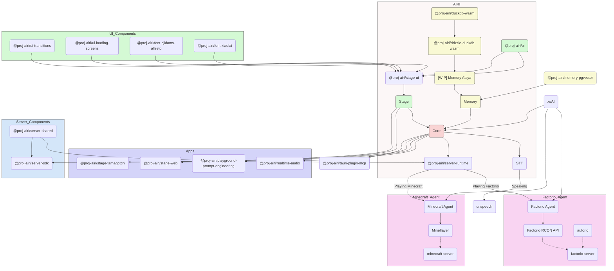

<picture>
  <source
    width="100%"
    srcset="./content/public/banner-dark-1280x640.avif"
    media="(prefers-color-scheme: dark)"
  />
  <source
    width="100%"
    srcset="./content/public/banner-light-1280x640.avif"
    media="(prefers-color-scheme: light), (prefers-color-scheme: no-preference)"
  />
  
</picture>

<h1 align="center">Dự án AIRI</h1>

<p align="center">Lấy ý tưởng từ Neuro-sama và chúng tôi đã tạo ra một AI waifu / nhân vật ảo để mang họ đến với thế giới của chúng ta.</p>

<p align="center">
  [<a href="https://airi.moeru.ai">Dùng thử</a>] [<a href="https://github.com/moeru-ai/airi/blob/main/docs/README.zh-CN.md">简体中文</a>] [<a href="https://github.com/moeru-ai/airi/blob/main/docs/README.ja-JP.md">日本語</a>]
</p>

<p align="center">
  <a href="https://deepwiki.com/moeru-ai/airi"></a>
  <a href="https://github.com/moeru-ai/airi/blob/main/LICENSE"></a>
  <a href="https://discord.gg/TgQ3Cu2F7A"></a>
  <a href="https://x.com/proj_airi"></a>
  <a href="https://t.me/+7M_ZKO3zUHFlOThh"></a>
</p>

<p align="center">
  <a href="https://www.producthunt.com/products/airi?embed=true&utm_source=badge-featured&utm_medium=badge&utm_source=badge-airi" target="_blank"></a>
  <a href="https://trendshift.io/repositories/14636" target="_blank"></a>
</p>

> Lấy cảm hứng mạnh mẽ từ [Neuro-sama](https://www.youtube.com/@Neurosama)

> [!WARNING]
> **Chú ý:** Chúng tôi **không** phát hành bất kỳ loại tiền điện tử hay token chính thức nào liên quan đến dự án này. Hãy kiểm tra kỹ thông tin trước khi tham gia.

> [!NOTE]
> Chúng tôi có cả một tổ chức riêng [@proj-airi](https://github.com/proj-airi) cho các dự án con xuất phát từ AIRI. Hãy xem qua nhé!
> Bao gồm: RAG, hệ thống bộ nhớ, cơ sở dữ liệu nhúng, icon, tiện ích Live2D, và nhiều hơn nữa.

Bạn đã từng mơ về một thực thể số sống động (cyber-waifu / husbando, thú cưng ảo) hay một bạn đồng hành kỹ thuật số có thể chơi cùng và trò chuyện với bạn chưa?

Với sức mạnh của các mô hình LLM (ngôn ngữ lớn) hiện nay như [ChatGPT](https://chatgpt.com) hay [Claude](https://claude.ai), việc yêu cầu nhân vật ảo nhập vai và trò chuyện với chúng ta đã trở nên rất dễ dàng. Các nền tảng như [Character.ai](https://character.ai), [JanitorAI](https://janitorai.com/) hay bản cài tự host như [SillyTavern](https://github.com/SillyTavern/SillyTavern) đã đủ tốt cho trải nghiệm trò chuyện và nhập vai.

> Nhưng còn việc **chơi game cùng bạn, xem bạn code, trò chuyện khi chơi game hoặc xem video, và làm được nhiều việc khác** thì sao?

Có lẽ bạn đã biết [Neuro-sama](https://www.youtube.com/@Neurosama). Cô ấy là VTuber ảo xuất sắc nhất hiện nay, có thể vừa chơi game, vừa trò chuyện và tương tác với bạn cũng như khán giả. Một số người còn gọi đây là “con người số” (digital human). **Đáng tiếc, vì không mã nguồn mở, bạn không thể tương tác với cô ấy khi buổi livestream kết thúc.**

Do đó, dự án AIRI mang đến một lựa chọn khác: **cho phép bạn sở hữu thực thể số của riêng mình, dễ dàng, mọi lúc, mọi nơi.**

---

## DevLogs Đã Đăng & Cập Nhật Gần Đây

- [DevLog @ 2025.07.18](https://airi.moeru.ai/docs/blog/DevLog-2025.07.18/) ngày 18 tháng 7, 2025
- [DreamLog 0x1](https://airi.moeru.ai/docs/blog/dreamlog-0x1/) ngày 16 tháng 6, 2025
- [DevLog @ 2025.06.08](https://airi.moeru.ai/docs/blog/DevLog-2025.06.08/) ngày 8 tháng 6, 2025
- [DevLog @ 2025.05.16](https://airi.moeru.ai/docs/blog/DevLog-2025.05.16/) ngày 16 tháng 5, 2025
- ...xem thêm tại [docs page](https://airi.moeru.ai/docs)

## Dự Án Này Có Gì Đặc Biệt?

Khác với các dự án VTuber AI mã nguồn mở khác, **アイリ** được xây dựng ngay từ đầu với sự hỗ trợ của nhiều công nghệ Web như [WebGPU](https://www.w3.org/TR/webgpu/), [WebAudio](https://developer.mozilla.org/en-US/docs/Web/API/Web_Audio_API), [Web Workers](https://developer.mozilla.org/en-US/docs/Web/API/Web_Workers_API/Using_web_workers), [WebAssembly](https://webassembly.org/), [WebSocket](https://developer.mozilla.org/en-US/docs/Web/API/WebSocket), v.v.

> [!TIP]
> Bạn lo lắng về hiệu năng khi chúng tôi dùng công nghệ Web?
>
> Đừng lo, phiên bản chạy trên trình duyệt chỉ nhằm minh hoạ khả năng có thể đạt được trong browser và webview. Phiên bản desktop của AIRI mặc định có thể dùng [NVIDIA CUDA](https://developer.nvidia.com/cuda-toolkit) và [Apple Metal](https://developer.apple.com/metal/) (nhờ HuggingFace & dự án [candle](https://github.com/huggingface/candle)), mà không cần quản lý phụ thuộc phức tạp. Đồ hoạ, bố cục, animation, và hệ thống plugin (WIP) vẫn tận dụng công nghệ Web để mở rộng dễ dàng.

Điều này có nghĩa là **アイリ có thể chạy trên các trình duyệt và thiết bị hiện đại**, kể cả thiết bị di động (đã hỗ trợ PWA). Điều này mở ra nhiều khả năng để chúng tôi (nhà phát triển) nâng VTuber アイリ lên tầm cao mới, đồng thời vẫn để người dùng linh hoạt bật các tính năng cần TCP hoặc công nghệ ngoài Web như kết nối kênh thoại Discord hay chơi Minecraft, Factorio với bạn bè.

> [!NOTE]
> Chúng tôi vẫn đang ở giai đoạn đầu phát triển và tìm kiếm nhà phát triển tài năng để cùng hiện thực hoá アイリ.
>
> Không sao nếu bạn chưa quen Vue.js, TypeScript, hay devtools của dự án này, bạn vẫn có thể tham gia với vai trò hoạ sĩ, nhà thiết kế, hoặc giúp chúng tôi tổ chức buổi livestream đầu tiên.
>
> Kể cả bạn là fan của React, Svelte hay Solid, chúng tôi vẫn chào đón. Bạn có thể mở thư mục phụ để thêm tính năng mà bạn muốn thử nghiệm cho アイリ.
>
> Các mảng (và dự án liên quan) chúng tôi cần:
> - Live2D modeller
> - VRM modeller
> - Nhà thiết kế avatar VRChat
> - Thị giác máy tính
> - Học tăng cường (Reinforcement Learning)
> - Nhận diện giọng nói
> - Tổng hợp giọng nói
> - ONNX Runtime
> - Transformers.js
> - vLLM
> - WebGPU
> - Three.js
> - WebXR ([xem thêm dự án khác](https://github.com/moeru-ai/chat) của tổ chức @moeru-ai)
>
> **Nếu bạn hứng thú, hãy giới thiệu bản thân ở đây: [Muốn tham gia cùng chúng tôi xây dựng AIRI?](https://github.com/moeru-ai/airi/discussions/33)**

## Tiến Độ Hiện Tại


Khả năng:

- [x] Bộ não
  - [x] Chơi game: [Minecraft](https://www.minecraft.net)
  - [x] Chơi game: [Factorio](https://www.factorio.com) (WIP, [PoC và demo có sẵn](https://github.com/moeru-ai/airi-factorio))
  - [x] Trò chuyện trên [Telegram](https://telegram.org)
  - [x] Trò chuyện trên [Discord](https://discord.com)
  - [ ] Bộ nhớ
    - [x] Hỗ trợ CSDL trong trình duyệt (DuckDB WASM | `pglite`)
    - [ ] Memory Alaya (WIP)
  - [ ] Suy luận cục bộ trong trình duyệt (WebGPU)
- [x] Khả năng nghe hiểu
  - [x] Nhận âm thanh từ trình duyệt
  - [x] Nhận âm thanh từ [Discord](https://discord.com)
  - [x] Nhận diện giọng nói phía client
  - [x] Phát hiện giọng nói chuyện phía client
- [x] Giọng nói
  - [x] Tổng hợp giọng nói bằng [ElevenLabs](https://elevenlabs.io/)
- [x] Cơ thể
  - [x] Hỗ trợ VRM
    - [x] Điều khiển model VRM
  - [x] Animation cho VRM
    - [x] Chớp mắt
    - [x] Tự động nhìn theo
    - [x] Chuyển động mắt khi idle
  - [x] Hỗ trợ Live2D
    - [x] Điều khiển model Live2D
  - [x] Animation cho Live2D
    - [x] Chớp mắt
    - [x] Tự động nhìn theo
    - [x] Chuyển động mắt khi idle

## Phát Triển

> Để xem hướng dẫn chi tiết phát triển, tham khảo [CONTRIBUTING.md](../.github/CONTRIBUTING.md)

> [!NOTE]
> Mặc định, `pnpm dev` sẽ khởi chạy server cho Stage Web (phiên bản trình duyệt).
> Nếu muốn phát triển bản desktop, hãy đọc [CONTRIBUTING.md](../.github/CONTRIBUTING.md) để cấu hình đúng môi trường.

```shell
pnpm i
pnpm dev
```

### Stage Web (Bản web tại [airi.moeru.ai](https://airi.moeru.ai))

```shell
pnpm dev
```

### Stage Tamagotchi (phiên bản máy tính)

```shell
pnpm dev:tamagotchi
```

Gói Nix dành cho Tamagotchi được bao gồm. Để chạy airi với Nix, trước tiên hãy đảm bảo bạn đã bật flakes, sau đó chạy:

```shell
nix run github:moeru-ai/airi
```

### Trang tài liệu

```shell
pnpm dev:docs
```

### Xuất bản

Vui lòng cập nhật phiên bản trong `Cargo.toml` sau khi chạy `bumpp`:

```shell
npx bumpp --no-commit --no-tag
```

## Các LLM API hỗ trợ (cung cấp bởi [xsai](https://github.com/moeru-ai/xsai))

- [x] [OpenRouter](https://openrouter.ai/)
- [x] [vLLM](https://github.com/vllm-project/vllm)
- [x] [SGLang](https://github.com/sgl-project/sglang)
- [x] [Ollama](https://github.com/ollama/ollama)
- [x] [Google Gemini](https://developers.generativeai.google)
- [x] [OpenAI](https://platform.openai.com/docs/guides/gpt/chat-completions-api)
  - [ ] [Azure OpenAI API](https://learn.microsoft.com/en-us/azure/ai-services/openai/reference) (PR welcome)
- [x] [Anthropic Claude](https://anthropic.com)
  - [ ] [AWS Claude](https://docs.anthropic.com/en/api/claude-on-amazon-bedrock) (PR welcome)
- [x] [DeepSeek](https://www.deepseek.com/)
- [x] [Qwen](https://help.aliyun.com/document_detail/2400395.html)
- [x] [xAI](https://x.ai/)
- [x] [Groq](https://wow.groq.com/)
- [x] [Mistral](https://mistral.ai/)
- [x] [Cloudflare Workers AI](https://developers.cloudflare.com/workers-ai/)
- [x] [Together.ai](https://www.together.ai/)
- [x] [Fireworks.ai](https://fireworks.ai/)
- [x] [Novita](https://www.novita.ai/)
- [x] [Zhipu](https://bigmodel.cn)
- [x] [SiliconFlow](https://cloud.siliconflow.cn/i/rKXmRobW)
- [x] [Stepfun](https://platform.stepfun.com/)
- [x] [Baichuan](https://platform.baichuan-ai.com)
- [x] [Minimax](https://api.minimax.chat/)
- [x] [Moonshot AI](https://platform.moonshot.cn/)
- [x] [Player2](https://player2.game/)
- [x] [Tencent Cloud](https://cloud.tencent.com/document/product/1729)
- [ ] [Sparks](https://www.xfyun.cn/doc/spark/Web.html) (PR welcome)
- [ ] [Volcano Engine](https://www.volcengine.com/experience/ark?utm_term=202502dsinvite&ac=DSASUQY5&rc=2QXCA1VI) (PR welcome)

## Các dự án phụ khác

- [Awesome AI VTuber](https://github.com/proj-airi/awesome-ai-vtuber): Danh sách tuyển chọn các AI VTuber và những dự án liên quan
- [`unspeech`](https://github.com/moeru-ai/unspeech): Máy chủ proxy endpoint chung cho `/audio/transcriptions` và `/audio/speech`, giống LiteLLM nhưng dành cho bất kỳ ASR và TTS nào
- [`hfup`](https://github.com/moeru-ai/hfup): Các công cụ hỗ trợ triển khai, đóng gói lên HuggingFace Spaces
- [`xsai-transformers`](https://github.com/moeru-ai/xsai-transformers): Nhà cung cấp thử nghiệm [🤗 Transformers.js](https://github.com/huggingface/transformers.js) cho [xsAI](https://github.com/moeru-ai/xsai).
- [WebAI: Realtime Voice Chat](https://github.com/proj-airi/webai-realtime-voice-chat): Ví dụ đầy đủ về việc triển khai voice realtime của ChatGPT từ đầu với VAD + STT + LLM + TTS.
- [`@proj-airi/drizzle-duckdb-wasm`](https://github.com/moeru-ai/airi/tree/main/packages/drizzle-duckdb-wasm/README.md): Trình điều khiển Drizzle ORM cho DuckDB WASM
- [`@proj-airi/duckdb-wasm`](https://github.com/moeru-ai/airi/tree/main/packages/duckdb-wasm/README.md): Wrapper dễ sử dụng cho `@duckdb/duckdb-wasm`
- [`tauri-plugin-mcp`](https://github.com/moeru-ai/airi/blob/main/crates/tauri-plugin-mcp/README.md): Plugin Tauri để tương tác với máy chủ MCP.
- [AIRI Factorio](https://github.com/moeru-ai/airi-factorio): Cho phép AIRI chơi Factorio
- [Factorio RCON API](https://github.com/nekomeowww/factorio-rcon-api): RESTful API wrapper cho console máy chủ headless Factorio
- [`autorio`](https://github.com/moeru-ai/airi-factorio/tree/main/packages/autorio): Thư viện tự động hóa Factorio
- [`tstl-plugin-reload-factorio-mod`](https://github.com/moeru-ai/airi-factorio/tree/main/packages/tstl-plugin-reload-factorio-mod): Tự động tải tạo lại mod Factorio khi đang phát triển
- [Velin](https://github.com/luoling8192/velin): Sử dụng Vue SFC và Markdown để viết prompt trạng thái dễ quản lý cho LLM
- [`demodel`](https://github.com/moeru-ai/demodel): Dễ dàng tăng tốc độ tải model và dataset từ nhiều runtime suy luận khác nhau
- [`inventory`](https://github.com/moeru-ai/inventory): Dịch vụ backend lưu trữ tập trung catalog model và cấu hình nhà cung cấp mặc định
- [MCP Launcher](https://github.com/moeru-ai/mcp-launcher): Công cụ tạo & khởi chạy MCP dễ dùng cho mọi máy chủ MCP, giống như Ollama nhưng cho MCP!
- [🥺 SAD](https://github.com/moeru-ai/sad): Tài liệu và ghi chú về tự host và chạy LLM trong trình duyệt.



## Các dự án tương tự

### Mã nguồn mở

- [kimjammer/Neuro: A recreation of Neuro-Sama originally created in 7 days.](https://github.com/kimjammer/Neuro): very well completed implementation.
- [SugarcaneDefender/z-waif](https://github.com/SugarcaneDefender/z-waif): Great at gaming, autonomous, and prompt engineering
- [semperai/amica](https://github.com/semperai/amica/): Great at VRM, WebXR
- [elizaOS/eliza](https://github.com/elizaOS/eliza): Great examples and software engineering on how to integrate agent into various of systems and APIs
- [ardha27/AI-Waifu-Vtuber](https://github.com/ardha27/AI-Waifu-Vtuber): Great about Twitch API integrations
- [InsanityLabs/AIVTuber](https://github.com/InsanityLabs/AIVTuber): Nice UI and UX
- [IRedDragonICY/vixevia](https://github.com/IRedDragonICY/vixevia)
- [t41372/Open-LLM-VTuber](https://github.com/t41372/Open-LLM-VTuber)
- [PeterH0323/Streamer-Sales](https://github.com/PeterH0323/Streamer-Sales)

### Mã nguồn đóng

- https://clips.twitch.tv/WanderingCaringDeerDxCat-Qt55xtiGDSoNmDDr https://www.youtube.com/watch?v=8Giv5mupJNE
- https://clips.twitch.tv/TriangularAthleticBunnySoonerLater-SXpBk1dFso21VcWD
- https://www.youtube.com/@NOWA_Mirai

## Trạng thái dự án


## Lời cảm ơn

- [Reka UI](https://github.com/unovue/reka-ui): Đã thiết kế trang tài liệu, trang chủ mới cũng dựa trên dự án này, đồng thời triển khai rất nhiều thành phần trong giao diện. (shadcn-vue sử dụng Reka UI làm headless, bạn nên xem qua!)
- [pixiv/ChatVRM](https://github.com/pixiv/ChatVRM)
- [josephrocca/ChatVRM-js: A JS conversion/adaptation of parts of the ChatVRM (TypeScript) code for standalone use in OpenCharacters and elsewhere](https://github.com/josephrocca/ChatVRM-js)
- Thiết kế và phong cách được lấy cảm hứng từ [Cookard](https://store.steampowered.com/app/2919650/Cookard/), [UNBEATABLE](https://store.steampowered.com/app/2240620/UNBEATABLE/), and [Sensei! I like you so much!](https://store.steampowered.com/app/2957700/_/), và các artworks của [Ayame by Mercedes Bazan](https://dribbble.com/shots/22157656-Ayame) cùng với [Wish by Mercedes Bazan](https://dribbble.com/shots/24501019-Wish)
- [mallorbc/whisper_mic](https://github.com/mallorbc/whisper_mic)
- [`xsai`](https://github.com/moeru-ai/xsai): Đã triển khai một số lượng lớn các gói để tương tác với LLM và mô hình, như [Vercel AI SDK](https://sdk.vercel.ai/) nhưng khá nhỏ.

## Lịch sử sao nhận được

[](https://www.star-history.com/#moeru-ai/airi&Date)
