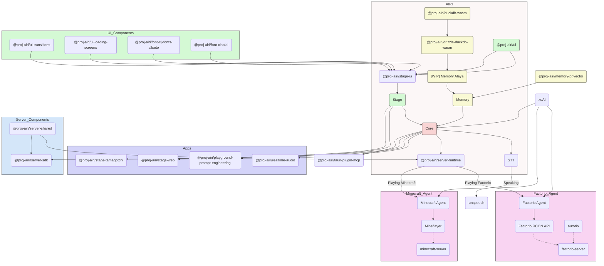

<picture>
  <source
    width="100%"
    srcset="./public/banner-dark-1280x640.png"
    media="(prefers-color-scheme: dark)"
  />
  <source
    width="100%"
    srcset="./public/banner-light-1280x640.png"
    media="(prefers-color-scheme: light), (prefers-color-scheme: no-preference)"
  />
  
</picture>

<h1 align="center">Project AIRI</h1>

<p align="center">
  [<a href="https://discord.gg/TgQ3Cu2F7A">加入 Discord</a>] [<a href="https://airi.moeru.ai">试试看</a>] [<a href="https://github.com/moeru-ai/airi/blob/main/README.md">English</a>] [<a href="https://github.com/moeru-ai/airi/blob/main/docs/README.ja-JP.md">日本語</a>]
</p>

<p align="center">
  <a href="https://deepwiki.com/moeru-ai/airi"></a>
  <a href="https://github.com/moeru-ai/airi/blob/main/LICENSE"></a>
    <a href="https://discord.gg/TgQ3Cu2F7A"></a>
  <a href="https://t.me/+7M_ZKO3zUHFlOThh"></a>
</p>

> 深受 [Neuro-sama](https://www.youtube.com/@Neurosama) 启发

> [!NOTE]
>
> 我们有一个专门的组织 [@proj-airi](https://github.com/proj-airi) 用于所有从 Project AIRI 诞生的子项目，快来看看吧！
>
> RAG（检索增强生成）、记忆系统、嵌入式数据库、图标、Live2D 实用工具等等！

# 你是否梦想过拥有一个赛博生命（网络老婆/老公、数字桌宠），或者能与你玩耍和交谈的 AI 伴侣？

借助现代大型语言模型的力量，像是 [ChatGPT](https://chatgpt.com) 和著名的 [Claude](https://claude.ai) 所能带来的，想要 LLM（大语言模型）和我们角色扮演、聊天已经超简单了，每个人都能上手。而像 [Character.ai（又称 c.ai）](https://character.ai) 和 [JanitorAI](https://janitorai.com/) 这样的平台，以及本地应用如 [SillyTavern（又称酒馆）](https://github.com/SillyTavern/SillyTavern)，已经是基于聊天或文字冒险游戏体验的相当不错的解决方案。

> 但是，如何赋予它们玩游戏的能力呢？让它们能看到你正在编写的代码？不仅能一边聊天一边玩游戏，也可以看视频，还能做很多其他事情？

你可能已经知道 [Neuro-sama](https://www.youtube.com/@Neurosama)，她目前是最好的能够玩游戏、聊天并与你和参与者（在VTuber社区中）互动的 AI VTuber / 伴侣，有些人也称这种存在为"数字人"。**可惜的是，她并不开源，当她从直播中下线后，你就无法与她互动了**。

因此，这个项目 AIRI，在这里提供了另一种可能性：**让你轻松拥有自己的数字生命、赛博生命，随时随地**。

## 这个项目有什么特别的呢？

与其他 AI 和 LLM 驱动的 VTuber 开源项目不同，アイリ VTuber 从开始开发的第一天开始就支持多种 Web 技术，涵盖诸如 [WebGPU](https://www.w3.org/TR/webgpu/)、[WebAudio](https://developer.mozilla.org/en-US/docs/Web/API/Web_Audio_API)、[Web Workers](https://developer.mozilla.org/en-US/docs/Web/API/Web_Workers_API/Using_web_workers)、[WebAssembly](https://webassembly.org/)、[WebSocket](https://developer.mozilla.org/en-US/docs/Web/API/WebSocket) 等已经广泛应用或仍在大量实验的 API。

这意味着 **アイリ VTuber 能够在现代浏览器和设备上运行**，甚至能够在移动设备上运行（已经完成了 PWA 支持），这为我们（贡献者们）带来了更多的可能性，让我们得以更进一步构建和扩展 アイリ VTuber 的外部功能，而与此同时也不失配置的灵活性——可以有选择地在不同设备上启用会需要 TCP 连接或其他非 Web 技术的功能，例如连接到 Discord 的语音频道一起开黑，或是和朋友们一起玩 Minecraft（我的世界）、Factorio（异星工厂）。

> [!NOTE]
>
> アイリ VTuber 仍处于早期开发阶段，我们欢迎优秀的开发者加入我们，一起将它变为现实。
>
> 即使不熟悉 Vue.js、TypeScript 和所需的其他开发工具也没关系，我们也欢迎艺术家、设计师、运营策划的加入，你甚至可以成为第一个用 アイリ VTuber 直播的博主。
>
> 如果你使用的是 React、 Svelte，甚至 Solid 也没关系，您可以自己创建一个子目录，添加您希望在 アイリ VTuber 中看到的功能，或者想实验的功能。
>
> 我们非常期待以下领域的朋友加入：
>
> - Live2D 模型师
> - VRM 模型师
> - VRChat 模型设计师
> - 计算机视觉（CV）
> - 强化学习（RL）
> - 语音识别
> - 语音合成
> - ONNX 推理运行时
> - Transformers.js
> - vLLM
> - WebGPU
> - Three.js
> - WebXR (也可以看看我们在 @moeru-ai 组织下另外的[这个项目](https://github.com/moeru-ai/chat))
>
> **如果你已经感兴趣了，为什么不来这里和大家打个招呼呢？[Would like to join part of us to build AIRI?](https://github.com/moeru-ai/airi/discussions/33)**

## 当前进度


- [x] 思维能力
  - [x] 玩 [Minecraft](https://www.minecraft.net)
  - [x] 玩 [Factorio](https://www.factorio.com)
  - [x] 在 [Telegram](https://telegram.org) 聊天
  - [x] 在 [Discord](https://discord.com) 聊天
  - [ ] 记忆
    - [x] 纯浏览器内数据库支持（基于 DuckDB WASM 或者 `sqlite`）
    - [ ] Alaya 记忆层（施工中）
  - [ ] 纯浏览器的本地推理（基于 WebGPU）
- [x] 语音理解
  - [x] 浏览器音频输入
  - [x] [Discord](https://discord.com) 音频输入
  - [x] 客户端语音识别
  - [x] 客户端说话检测
- [x] 语言能力
  - [x] [ElevenLabs](https://elevenlabs.io/) 语音合成
- [x] 身体动作
  - [x] VRM 支持
    - [x] 控制 VRM 模型
  - [x] VRM 模型动画
    - [x] 自动眨眼
    - [x] 自动看
    - [x] 空闲眼睛移动
  - [x] Live2D 支持
    - [x] 控制 Live2D 模型
  - [x] Live2D 模型动画
    - [x] 自动眨眼
    - [x] 自动看
    - [x] 空闲眼睛移动

## 开发

> 有关开发此项目的具体教程，参见 [CONTRIBUTING.md](./CONTRIBUTING.md)

```shell
pnpm i
pnpm dev
```

### 网页版 (也就是 [airi.moeru.ai](https://airi.moeru.ai) 的版本)

```shell
pnpm dev:web
```

### 桌面版（也叫拓麻歌子，aka 电子宠物）

```shell
pnpm dev:tamagotchi
```

### 文档站

```shell
pnpm -F @proj-airi/docs dev
```

## 原生支持的 LLM API 服务来源列表（由 [xsai](https://github.com/moeru-ai/xsai) 驱动）

- [x] [OpenRouter](https://openrouter.ai/)
- [x] [vLLM](https://github.com/vllm-project/vllm)
- [x] [SGLang](https://github.com/sgl-project/sglang)
- [x] [Ollama](https://github.com/ollama/ollama)
- [x] [Google Gemini](https://developers.generativeai.google)
- [x] [OpenAI](https://platform.openai.com/docs/guides/gpt/chat-completions-api)
  - [ ] [Azure OpenAI API](https://learn.microsoft.com/en-us/azure/ai-services/openai/reference)
- [x] [Anthropic Claude](https://anthropic.com)
  - [ ] [AWS Claude](https://learn.microsoft.com/en-us/azure/ai-services/openai/reference)
- [x] [深度求索 DeepSeek](https://www.deepseek.com/)
- [x] [通义千问 Qwen](https://help.aliyun.com/document_detail/2400395.html)
- [x] [xAI](https://x.ai/)
- [x] [Groq](https://wow.groq.com/)
- [x] [Mistral](https://mistral.ai/)
- [x] [Cloudflare Workers AI](https://developers.cloudflare.com/workers-ai/)
- [x] [Together.ai](https://www.together.ai/)
- [x] [Fireworks.ai](https://www.together.ai/)
- [x] [Novita](https://www.novita.ai/)
- [x] [智谱](https://bigmodel.cn)
- [x] [硅基流动](https://cloud.siliconflow.cn/i/rKXmRobW)
- [x] [阶跃星辰](https://platform.stepfun.com/)
- [x] [百川](https://platform.baichuan-ai.com)
- [x] [Minimax](https://api.minimax.chat/)
- [x] [月之暗面](https://platform.moonshot.cn/)
- [x] [Player2](https://player2.game/)
- [x] [腾讯混元](https://cloud.tencent.com/document/product/1729)
- [ ] [讯飞星火](https://www.xfyun.cn/doc/spark/Web.html)
- [ ] [火山引擎（豆包）](https://www.volcengine.com/experience/ark?utm_term=202502dsinvite&ac=DSASUQY5&rc=2QXCA1VI)

## 从这个项目诞生的子项目

- [`unspeech`](https://github.com/moeru-ai/unspeech): 用于代理 `/audio/transcriptions` 和 `/audio/speech` 的代理服务器实现，类似 LiteLLM 但面向任何 ASR 和 TTS
- [`hfup`](https://github.com/moeru-ai/hfup): 帮助部署、打包到 HuggingFace Spaces 的工具集
- [`@proj-airi/drizzle-duckdb-wasm`](https://github.com/moeru-ai/airi/tree/main/packages/drizzle-duckdb-wasm/README.md): DuckDB WASM 的 Drizzle ORM driver 驱动
- [`@proj-airi/duckdb-wasm`](https://github.com/moeru-ai/airi/tree/main/packages/duckdb-wasm/README.md): 易于使用的 `@duckdb/duckdb-wasm` 封装
- [`@proj-airi/lobe-icons`](https://github.com/proj-airi/lobe-icons): 为 [lobe-icons](https://github.com/lobehub/lobe-icons) 漂亮的 AI & LLM 图标制作的 Iconify JSON 封装，支持 Tailwind 和 UnoCSS
- [AIRI Factorio](https://github.com/moeru-ai/airi-factorio): 让 AIRI 玩 Factorio
- [Factorio RCON API](https://github.com/nekomeowww/factorio-rcon-api): Factorio 无头服务器控制台的 RESTful API 封装
- [`autorio`](https://github.com/moeru-ai/airi-factorio/tree/main/packages/autorio): Factorio 自动化库
- [`tstl-plugin-reload-factorio-mod`](https://github.com/moeru-ai/airi-factorio/tree/main/packages/tstl-plugin-reload-factorio-mod): 开发时支持热重载 Factorio 模组
- [🥺 SAD](https://github.com/moeru-ai/sad): 自托管和浏览器运行 LLM 的文档和说明
- [Velin](https://github.com/luoling8192/velin): 用 Vue SFC 和 Markdown 文件来为 LLM 书写简单好用的提示词
- [`demodel`](https://github.com/moeru-ai/demodel): 轻松加速各种推理引擎和模型下载器拉/下载模型或数据集的速度
- [`inventory`](https://github.com/moeru-ai/inventory): 中心化模型目录和默认服务来源配置的公开 API 服务
- [MCP Launcher](https://github.com/moeru-ai/mcp-launcher): 易于使用的 MCP 启动器，适用于所有可能的 MCP Server，就像用于模型推理的 Ollama 一样！
- ~~[`@proj-airi/elevenlabs`](https://github.com/moeru-ai/airi/tree/main/packages/elevenlabs): ElevenLabs API 的类型定义~~



## 同类项目

### 开源项目

- [kimjammer/Neuro: A recreation of Neuro-Sama originally created in 7 days.](https://github.com/kimjammer/Neuro)：非常完善的 Neuro-Sama 实现
- [SugarcaneDefender/z-waif](https://github.com/SugarcaneDefender/z-waif)：以游戏、自主代理和提示词工程见长
- [semperai/amica](https://github.com/semperai/amica/)：适配 VRM, WebXR
- [elizaOS/eliza](https://github.com/elizaOS/eliza)：将 AI 智能体集成至各类系统和 API 中的一个软件工程实践
- [ardha27/AI-Waifu-Vtuber](https://github.com/ardha27/AI-Waifu-Vtuber)：Twitch API 集成
- [InsanityLabs/AIVTuber](https://github.com/InsanityLabs/AIVTuber)：优秀的 UI/UX 设计
- [IRedDragonICY/vixevia](https://github.com/IRedDragonICY/vixevia)
- [t41372/Open-LLM-VTuber](https://github.com/t41372/Open-LLM-VTuber)
- [PeterH0323/Streamer-Sales](https://github.com/PeterH0323/Streamer-Sales)

### 非开源项目

- https://clips.twitch.tv/WanderingCaringDeerDxCat-Qt55xtiGDSoNmDDr https://www.youtube.com/watch?v=8Giv5mupJNE
- https://clips.twitch.tv/TriangularAthleticBunnySoonerLater-SXpBk1dFso21VcWD

## 项目状态


## 鸣谢

- [pixiv/ChatVRM](https://github.com/pixiv/ChatVRM)
- [josephrocca/ChatVRM-js: A JS conversion/adaptation of parts of the ChatVRM (TypeScript) code for standalone use in OpenCharacters and elsewhere](https://github.com/josephrocca/ChatVRM-js)
- UI 和样式的设计受 [Cookard](https://store.steampowered.com/app/2919650/Cookard/)，[UNBEATABLE](https://store.steampowered.com/app/2240620/UNBEATABLE/)，以及 [Sensei! I like you so much!](https://store.steampowered.com/app/2957700/_/)，还有 [Ayame by Mercedes Bazan](https://dribbble.com/shots/22157656-Ayame) 和 [Wish by Mercedes Bazan](https://dribbble.com/shots/24501019-Wish) 的作品启发
- [mallorbc/whisper_mic](https://github.com/mallorbc/whisper_mic)
- [`xsai`](https://github.com/moeru-ai/xsai)：实现了相当数量的包来与 LLM 和模型交互，像 [Vercel AI SDK](https://sdk.vercel.ai/) 但是更小

## Star History

[](https://www.star-history.com/#moeru-ai/airi&Date)
