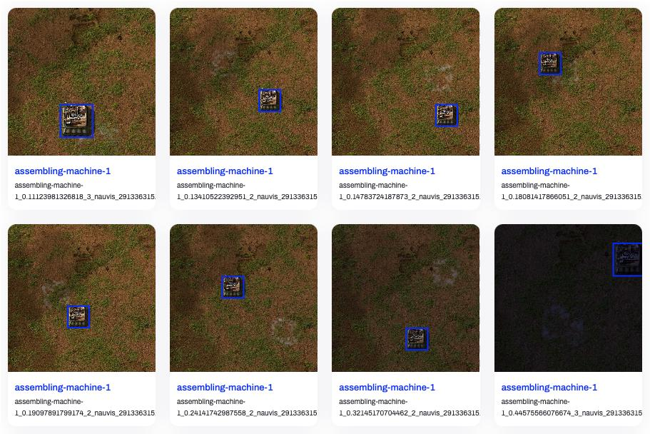

大家好久不见，我是 [@LemonNeko](https://github.com/LemonNekoGH)，AIRI 的维护者之一。~~啊，有点厌倦这样开场了，像 LLM 一样。~~

我的上一篇 [DevLog](../DevLog-2025.07.18/index.md) 中提到，我浅浅地看了一下 [Factorio Learning Environment](https://arxiv.org/abs/2503.09617) 论文，并且简单说了一下我们打算如何改进 `airi-factorio`，但是...今天想和大家分享的并不是这个，而是关于纯视觉方向的进展。

在今年六月的时候，[@nekomeowww](https://github.com/nekomeowww) 发布了一个几乎实时的 [VLM Playground](https://huggingface.co/spaces/moeru-ai/smolvlm-realtime-webgpu-vue) HuggingFace Spaces，感觉非常的酷，所以我打算先试一下简单的实时图像识别（当时我还把目标检测和图像识别弄混），然后以某种方式交给 AI 去做决策，最后以某种方式输出动作给游戏去执行。

先给大家看一下成果：

<video src="./assets/airi-factorio-yolo-v0-playground-vnc.mp4" controls />

视频中，我在网页里连接了 VNC 来游玩 Factorio，右侧的是目标检测的结果，几乎是实时的，我也部署到 [HuggingFace Space](https://huggingface.co/spaces/proj-airi/factorio-yolo-v0-playground) 了，欢迎来玩。

那，我是怎么做到的呢？

## 把 Factorio 客户端装进 Docker 里

为了能让 AI 看到游戏画面，我们需要确保 Factorio 运行在可控的环境中，不会受我们的窗口大小、位置等影响，同时，我们也会希望这套环境是可以开箱即用的，所以，我选择把 Factorio 装进 Docker 里。

Factorio 官方提供了 [Docker 镜像](https://hub.docker.com/r/factoriotools/factorio)，但是那是纯服务端，如果想要让 AI 看到画面，让 AI 来控制游戏，我们需要一个客户端，但是没有找到现成的 Docker 镜像（而且 Factorio 的许可协议不允许这样分发客户端），我们需要自己打包了（而且我们也依然不能分发我们打包的客户端镜像，只能分享 Dockerfile 了）。

那把 Factorio 客户端~~这头大象~~装进~~名为~~ Docker ~~的冰箱~~里，一共分几步？

1. 下载 Factorio 客户端：当然，它是主角。
2. 准备一个虚拟显示器：具有图形界面的应用需要一个显示器才能显示画面嘛。
3. 准备 VNC 服务：它可以读取到虚拟显示器的内容，把画面传给外部的 VNC 客户端，同时把用户的输入传给游戏。

好像漏了什么？啊，音频？什么音频？不存在的，现在的 AI 还不会听声音，我们先忽略。

### 下载 Factorio 客户端

Factorio 官方网站中可以直接点击下载，但是需要手动操作登录，这不方便构建自动化流程，所以，我找了一个下载脚本 [factorio-dl](https://github.com/moviuro/factorio-dl/) 这是一个非常复杂的 shell 脚本，给它提供用户名，密码和要下载的版本，它就会自动根据系统架构下载对应的客户端。

### 准备一个虚拟显示器

这一步稍微复杂一点，但是它没有像安装一整个桌面环境那么复杂，我也是这时候才知道图形界面程序可以不需要桌面环境，不需要窗口管理器，只要一个最简单的 X 环境和一个显示服务器就可以了。

非常简单：

```bash
sudo apt install -y xvfb x11-apps mesa-utils
```

其中：

- `xvfb` 是一个虚拟的帧缓冲器和 X 服务器。
- `x11-apps` 是一些 X 相关的工具，安装它的时候会同时安装 X 环境。
- `mesa-utils` 是一些 Mesa 相关的工具，Mesa 是 OpenGL 的软件实现，它提供了一些工具来帮助我们测试和调试 OpenGL 程序。

### 准备 VNC 服务

VNC 是 Virtual Network Computing 的缩写，它是一个远程桌面协议，可以让我们在远程控制另一台计算机，就像我们直接坐在那台计算机前面一样。

```bash
sudo apt install -y x11vnc
```

有了这些，我们就可以在 Docker 中运行 Factorio 客户端，用 VNC 来控制它了。

但是这还不够，我的目标是在浏览器中游玩并实时进行目标检测的推理，然而浏览器里只能用 HTTP 协议，所以我们需要用 `websockify` 这样的工具来将 VNC 协议转换为 HTTP 协议，同时，为了方便 Debug，我们还需要一个 Web 界面来显示 VNC 的画面，所以我们还需要安装 `novnc`。

```bash
sudo apt install -y websockify novnc
```

好，这样一来 Docker 镜像就准备好了，可以在这里看完整的 [Dockerfile](https://github.com/moeru-ai/airi-factorio/blob/a6bf243f14cbc0d765ff7ed13389bca33c1fdfa2/docker/Dockerfile) 和[使用说明](https://github.com/moeru-ai/airi-factorio/tree/ba46a4e47b31187dd064b06314b595b551ed3411/apps/factorio-yolo-v0-playground)。

## 训练目标检测模型

为了快速验证，我直接用 YOLO11n 的预训练模型作为基础来训练我们的目标检测模型。

### 准备数据集

我是这样收集数据集的：

1. 使用 [`surface.create_entity`](https://lua-api.factorio.com/latest/classes/LuaSurface.html#create_entity) 函数来在场景中随机位置放置机器，和机器的选择框（selection_box）大小和位置。
2. 使用 [`game.take_screenshot`](https://lua-api.factorio.com/latest/classes/LuaGameScript.html#take_screenshot) 以各种缩放比例和光照条件（daytime）来截屏。
3. 根据选择框生成标注数据并使用 [`helpers.write_file`](https://lua-api.factorio.com/latest/classes/LuaHelpers.html#write_file) 来保存到文件里。

我的收集脚本在[这里](https://github.com/moeru-ai/airi-factorio/blob/ba46a4e47b31187dd064b06314b595b551ed3411/packages/factorio-rcon-snippets-for-node/src/factorio_yolo_dataset_collector_v0.ts)，它使用 `typescript-to-lua` 来把 TypeScript 编译成 Lua，然后使用 RCON 来传递给 Factorio 执行。

在脚本中，我收集了三个型号的组装机和传送带，每个机器收集了 20 张图片，每张图片 1280x1280 分辨率，没有包含 UI。

哦还有，为了能更好的 Debug 我的收集脚本，我开发了一个 [VSCode 插件](https://github.com/moeru-ai/airi-factorio/blob/ba46a4e47b31187dd064b06314b595b551ed3411/packages/vscode-factorio-rcon-evaluator/README.md)，它提供了一个 CodeLens 操作，可以一键编译并执行我的脚本。

图片和标注数据都收集好后，我们需要按 [YOLO 官方的格式](https://docs.ultralytics.com/datasets/detect/) 来组织数据集，然后可以传到 [Ultralytics Hub](https://www.ultralytics.com/hub) 上来看看效果：



是不是看上去还行？那我们开始训练吧！

### 训练模型

由于我刚入门，所以我直接从 [Get Started](https://docs.ultralytics.com/tasks/detect/) 开始，抄来了这几行代码：

```python
from ultralytics import YOLO

model = YOLO("yolo11n.pt")
model.train(data="./dataset/detect.yaml", epochs=100, imgsz=640, device="mps")
model.export(format="onnx")
```

以 640x640 的分辨率，使用 MPS 设备（在 macOS 上，使用 MPS 设备可以获得更好的性能），训练了 100 个 epoch，每个 epoch 有 5 个 batch，大概在 70 epoch 时达到最佳效果，导出了 ONNX 模型。训练耗时大约 8 分钟，模型大小约为 10MB。

可以在 [这里](https://github.com/moeru-ai/airi-factorio/blob/ba46a4e47b31187dd064b06314b595b551ed3411/apps/factorio-yolo-v0-playground) 看到数据集、训练代码和导出的 ONNX 模型。

## 进行推理

现在可以把以上两个零件组装起来了，我用了:

1. `@novnc/novnc` 来在浏览器中显示 VNC 画面，同时把画布的数据拿出来喂给模型。
2. `onnxruntime-web` 来在浏览器中进行推理，它提供了 WebGPU 的支持，可以利用 GPU 的性能。

一开始，推理速度非常慢，大概 400ms 左右，而且会卡死 UI，连 VNC 都没法好好显示了，我临时学了点 WebWorker 的使用方法，把推理和显示分开，才解决了这个问题，并且我发现我并没有真的启用 WebGPU，所以速度还是慢。

```typescript
ort.InferenceSession.create(model, { executionProviders: ['webgpu', 'wasm'] })
```

要写清楚允许使用 WebGPU 和 WASM 两种执行方式，这样可以在 WebGPU 不可用时，自动切换到 WASM 执行。

在启用 WebGPU 之后，推理速度提升到了 80ms 左右，我还是嫌慢，但是我又不知道该怎么继续优化下去了，这时候 Cursor 和我说：「你在像素颜色值归一化的时候，一直在除以 255，你应该先把 `1/255` 算出来，然后直接乘以这个值，这样就可以避免除法了」。

嗯？等一下，原来除法比乘法慢吗？果然跳过的计算机科学课还是得补回来。

按照 Cursor 的建议，我改了下代码，推理速度提升到了 20ms 左右，体验已经非常不错了。

我们刚刚跳过了处理模型输出的部分，现在我们来看看怎么处理模型输出。

### 处理模型输出

模型输出了一个 84000 个元素的数组，和 `dims` 为 `[1, 10, 8400]` 的数组，这意味着 84000 个元素是以 10 个为一组的，每组有边界框的中心 x 和 y 坐标、边界框的宽高、6 个类别分别的置信度，一共 8400 组结果。

在以置信度 0.6 为阈值过滤掉置信度低的边界框后，我们还需要使用 IOU 作为 NMS 手段，来过滤掉重叠的边界框。

关于 IOU 和 NMS，可以参考[这篇文章](https://medium.com/@jesse419419/understanding-iou-and-nms-by-a-j-dcebaad60652)。简单来说，就是把两个框的面积加起来，再减去它们的重叠面积，得到实际占用面积，然后用重叠面积除以实际占用面积，得到 IOU。

我使用了一个非常简单的 NMS 实现，它把所有边界框按置信度排序，然后从高到低遍历，如果一个边界框的 IOU 大于 0.7，就认为它们是同一个物体，就把它过滤掉。

```typescript
function nms(boxes: Box[], iouThreshold: number): Box[] {
  // 1. Filter by confidence and sort in descending order
  const candidates = boxes
    .filter(box => box.confidence > 0.6)
    .sort((a, b) => b.confidence - a.confidence)

  const result: Box[] = []

  while (candidates.length > 0) {
    // 2. Pick the box with the highest confidence
    const bestCandidate = candidates.shift()!
    result.push(bestCandidate)

    // 3. Compare with remaining boxes and remove ones with high IOU
    for (let i = candidates.length - 1; i >= 0; i--) {
      // The iou() function needs to be implemented separately, as described in the article.
      if (iou(bestCandidate, candidates[i]) > iouThreshold) {
        candidates.splice(i, 1)
      }
    }
  }

  return result
}
```

可以在[这里](https://github.com/moeru-ai/airi-factorio/tree/ba46a4e47b31187dd064b06314b595b551ed3411/apps/factorio-yolo-v0-playground)看整个 Playground 的源代码。

### 发现的问题

在这么实践下来，我发现了几个问题：

1. 无法识别非正方形图片：一旦遇到非正方形图片，模型输出的所有结果的置信度都会非常低，甚至为 0。
2. 模型可以区分一级组装机和二级组装机，但是它会把箱子等方形物体也识别为组装机。
3. 实际游戏中，机器贴图上往往会叠加一些状态标志，比如电力、现在的配方、使用的插件等，这些标志会干扰模型的识别。

## 最后

到了这里，就是我这个月来的成果了，收获颇丰啊，非常感谢 [@nekomeowww](https://github.com/nekomeowww) 和 [@dsh0416](https://github.com/dsh0416) 和 [makito](https://github.com/sumimakito) 对我的帮助。接下来我该想办法提升一下模型性能，然后以某种方式让 AI 来控制游戏了。
