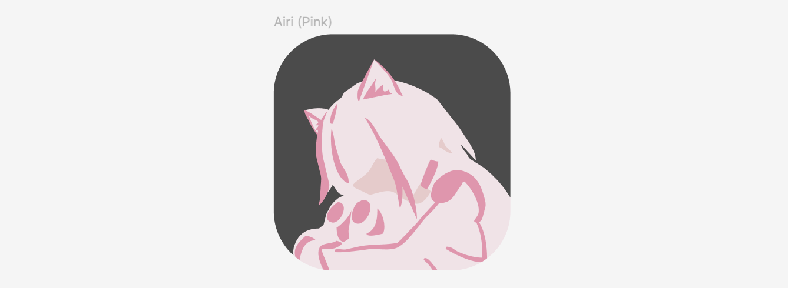
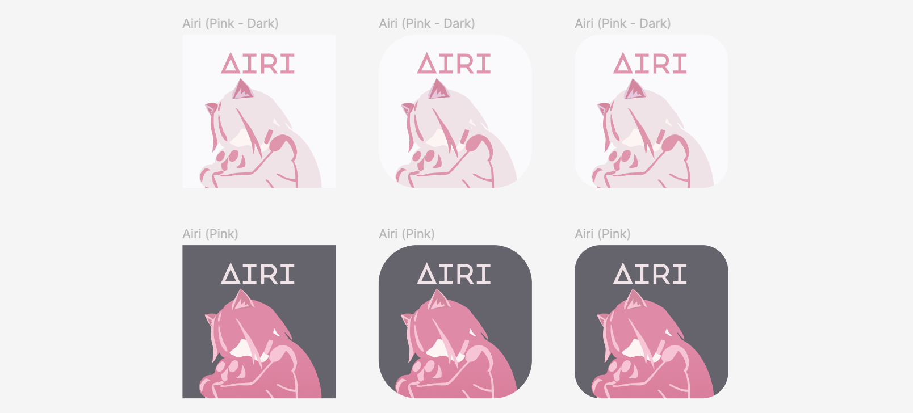
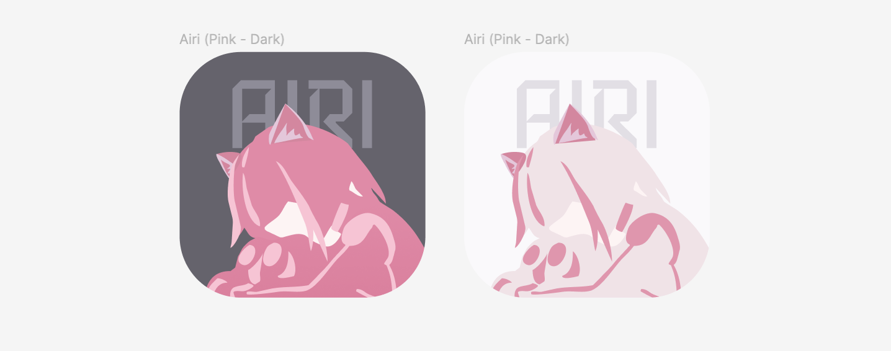
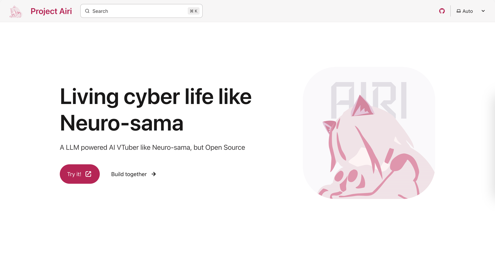

## Dejavu

Yesterday I added one extra package called
[`gpuu` (GPU utilities)](https://github.com/moeru-ai/gpuu)
to help us work with WebGPU, and perhaps we can use it to interact with real
GPU devices too. There is not that much capabilities it can do right now,
we will add more capabilities for it in the future.

It feels like this:

```ts
import { check } from 'gpuu/webgpu'
import { onMounted } from 'vue'

onMounted(async () => {
  const result = await check()
  console.log(result)

  // do something with the result
})
```

Last week, our corporate designer/artist has submitted our commission for the
basic/first version of Project AIRI logo. The feeling of the logo looks like
this:


## Daytime

From the perspective of designing, these were so complex and user unfriendly
when scaled down to Home Screen app sizes. Therefore I added this version:


And edited with other variants:


All of those were only suitable for dark theme, "we need a dark theme version
logo as well!" I thought, so I did this:



[@kwaa](https://github.com/kwaa) said that we can try to swap the color schemes
for both themes:



This indeed looks better.

We updated the Typography too:


And optimized the background colors:


So this is what we get finally:



Later on today, I was working on publishing the
[documentation site](https://airi.build) of Project AIRI online, for me,
and other developers, artists to use it as a reference and guidelines.

I did it! And the newly designed logo has been put into the
[documentation site](https://airi.build) along with the color palette:




[Basic guide](../guides/),
[contribution guidelines](../references/contributing/guide/),
and [designing guidelines](../references/design-guidelines/)
were all included from this moment.

I spent a whole noon to get a feel of the Text PV animations on YouTube,
I really like them, I wish I can implement similar transitioning effect on
browser too!

https://www.youtube.com/watch?v=_AIgv0EsOE4

Luckily, I do know a developer & artist that really good at this:
[yui540](https://github.com/yui540) (you can check his/her personal website
here: [yui540.com](https://yui540.com)), and he/she just posted a brand new
repository for demonstrating the fantastic transition effects he/she used.

I added the related resources and website links into the
[https://airi.build](https://airi.build) site, you can check them out.

## DevStream

I ported many of the animation transitions from [yui540](https://github.com/yui540)'s
[repository](https://github.com/yui540/css-animations) to
[https://proj-airi-packages-ui-transitions.netlify.app/#/](https://proj-airi-packages-ui-transitions.netlify.app/#/).

It worked really well:


That's all for today's DevLog, thank you to everyone that joined the DevStream
and stayed with me until the end. I'll see you all tomorrow.
